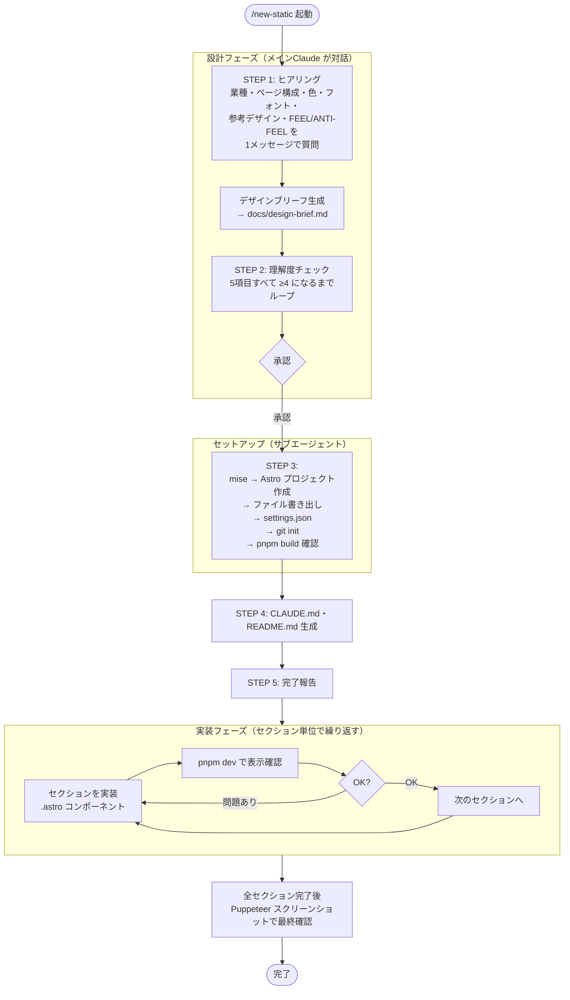

# /new-static

Astro + Node.js で静的サイト（LP・PoC・管理画面モック等）プロジェクトをセットアップする。
**プロジェクトディレクトリを作成して `cd` で移動した後に実行すること。**

## 使い方

- `/new-static` — カレントディレクトリに静的サイトをセットアップする
- 動的機能・バックエンドが必要なら `/new-project` を使うこと（intake → planner → 実装のフルチェーン）

## フロー概要



## いつ使うか

| ケース | スキル |
|--------|--------|
| LP・静的ページ | `/new-static` |
| PoC・画面モック（フロントのみ） | `/new-static` |
| 管理画面・ダッシュボード（静的） | `/new-static` |
| API・DB・認証が必要 | `/new-project` |

---

## 手順

### ステップ 1: ヒアリング & デザインブリーフ作成（メインClaude自身が実行）

> **注意:** サブエージェントはユーザーと対話できない。ヒアリングは必ずメインClaude自身が行うこと。

```
REQUIRE: カレントディレクトリがプロジェクトルートであること

IF NOT EXISTS(docs/):
  MKDIR docs/
ENDIF

IF NOT EXISTS(docs/design-brief.md):
  COPY ~/.claude/commands/new-project/templates/design-brief.md
    → <cwd>/docs/design-brief.md
ENDIF

ASSERT EXISTS(docs/design-brief.md)

--- ヒアリング（SELF = メインClaudeがユーザーに直接質問する） ---

SELF: 以下を 1つのメッセージ でユーザーに質問する
  1. 業種・サービス内容とターゲットユーザー（誰に届けたいか）
  2. ページ構成（単一ページ / 複数ページ。複数の場合は画面名を列挙してもらう）
  3. 画面の明暗（ダーク系 / ライト系 / どちらでも）
  4. 色の方向性（使いたい色・避けたい色・ブランドカラーの有無）
  5. 文字の印象（A. 丸みがあって親しみやすい / B. きっちり直線的 / C. どちらでもない）
  6. 参考にしたいデザイン（サービス名 + 好きな部分を1〜3つ、なければ「なし」でOK）
  7. 感じてほしい印象（FEEL 3語）・感じてほしくない印象（ANTI-FEEL 3語）

WAIT_FOR: ユーザーの回答

--- デザインブリーフ作成（SELF = メインClaudeが記入する） ---

SELF: ヒアリング回答をもとに docs/design-brief.md の全TODOを埋める
  - ブランドアーキタイプはヒアリング結果から推定して選択する
  - 仮定で埋めた項目がある場合は、その旨をユーザーに明示すること

--- プロジェクト名・サービス名の決定 ---

ユーザーからサービス名・プロジェクト名の指定がない場合:
  RECOMMENDED: 「SAMPLE IMS」「DEMO SHOP」など、サンプルであることが一目でわかる名前を使う
  ALTERNATIVE: ユーザーに希望を確認する
  PROHIBITED: 実在するブランド・サービスの名前を流用すること
  理由: 後から名前変更が必要になると、レイアウト崩れ・文言の意味的不整合が連鎖して発生する

--- サンプルデータのルール ---

ユーザーから実際のデータの指定がない場合、プロジェクト種別に応じた架空データを使うこと:

  共通ルール:
    REQUIRED: サンプルであることが一目でわかる値にする
    PROHIBITED: 実在する個人名・会社名・住所・電話番号・URLを組み合わせること

  BtoC向けLP（住所・電話番号・SNSが必要な場合）:
    住所: 郵便番号「〒000-0000」、都市名・区・町名はすべて架空（例: 架空都サンプル区見本町）
    電話番号: 市外局番「000」（例: 000-0000-0000）
    SNS・URL: href は「#」か「javascript:void(0)」。実在サービスのルートURLをリンク先に使わないこと
    アクセス案内: 架空の路線名・駅名（例: 架空線「サンプル駅」北口より徒歩5分）

  業務ツール・PoC（人名・組織名・インシデントデータ等が必要な場合）:
    人名: 架空の日本人名（例: 田中 健、鈴木 理恵）
    組織名: 「サンプル株式会社」「架空チーム」など
    IDや数値: 実運用を想定した形式だが実在しない値（例: INC-001、#00000）

THEN: 埋めたデザインブリーフの内容をユーザーに簡潔に見せる
```

---

### ステップ 2: 理解度チェック（Early Stop）& ユーザー確認

designer のヒアリング後でも、AI が仮定で埋めた部分が残っている可能性がある。
セットアップ前にここで潰す。

```
REPEAT:
  SELF_EVALUATE: 以下の5項目を 1〜5 で採点する
    スケール: 1=全く不明 / 2=断片的 / 3=概ね把握 / 4=ほぼ確信 / 5=完全に理解

    | # | 評価項目                                          | スコア |
    |---|---------------------------------------------------|--------|
    | 1 | 目的・ターゲット（誰に・何を伝えるLPか）            |        |
    | 2 | コンテンツ・訴求ポイント（何を見せるか・伝えるか）  |        |
    | 3 | デザイン方針（ビジュアルトーン・ブランド制約）      |        |
    | 4 | 技術的制約（アニメーション・フォーム・外部連携）    |        |
    | 5 | 完了条件（何をもって完成とするか・公開先・締め切り）|        |

  IF ANY(score < 4):
    ASK USER: スコアが4未満の項目について不明点を質問する
  ENDIF
UNTIL ALL(score >= 4)

GATE: ユーザー承認
  SHOW USER:
    "デザインブリーフが完成しました。この方針で実装を進めますか？"
  WAIT_FOR: ユーザーが明示的に承認する
  PROHIBITED: 承認を受け取る前にステップ3へ進むこと
  IF NOT CONFIRMED: STOP
```

---

### ステップ 3: セットアップ（サブエージェントで実行）

Agent ツールでサブエージェントを起動し、以下のプロンプトを渡す。
**変数 `<cwd>` は実際の絶対パスに展開してから渡すこと。**
サブエージェントが完了したら結果のみ受け取り、続きに進む。

---

**サブエージェントへのプロンプト:**

```
以下の STEP を上から順に実行してください。スキップ禁止。

IMPORTANT: 以下の操作はすべてユーザーへの確認なしに即座に実行すること。
  - TEMPLATE ディレクトリからのファイルコピー（Read → Write）
  - ディレクトリ作成（mkdir）
  - ビルド・インストールコマンドの実行
  確認が必要なのは rm / git の破壊的操作のみ。

NOTE: .mcp.json と .claude/commands/git-workflow.md への Write は
  settings.json の permissions.allow に登録されているため自動承認される。
  初回セットアップ中（settings.json 書き出し前）に確認が表示された場合は
  「はい」を選択して続行すること。

CWD        = <現在の作業ディレクトリの絶対パス>
TEMPLATE   = ~/.claude/commands/new-project

--- STEP 1: Node / pnpm 環境構築 ---

REQUIRE: カレントディレクトリが CWD であること

RUN:
  mise use --path .mise.toml node@lts
  mise use --path .mise.toml pnpm@latest
NOTE: --path .mise.toml を必ず付けること（付けないと上位の .mise.toml が更新される）

RUN:
  mise install

ASSERT: `mise exec -- node --version` が成功すること
ASSERT: `mise exec -- pnpm --version` が成功すること

--- STEP 2: Astro プロジェクト作成 ---

RUN:
  mise exec -- pnpm create astro@latest . --template minimal --no-git --yes

NOTE: `pnpm create astro@latest` は常に最新版をインストールする。
  メジャーバージョンが変わるとコンポーネント構文・設定ファイルの形式が変わる場合がある。
  インストール後、生成された package.json でバージョンを確認すること。

ASSERT EXISTS(package.json)

--- STEP 2.5: Astro が生成した不要ディレクトリの削除 ---

IF EXISTS(CWD/.vscode):
  RUN: rm -rf CWD/.vscode
  NOTE: Astro create が生成するが Claude Code では不要
ENDIF

--- STEP 3: settings.json の書き出し（最初に実施してパーミッション設定を有効化） ---

READ TEMPLATE/settings.json
REPLACE ALL: ".claude/hooks/" → "<CWD>/.claude/hooks/"  # <CWD> は実際の絶対パス（例: /Users/alice/myproject）
WRITE CWD/.claude/settings.json  ← Write ツールを使うこと（Bash 禁止）

例 (CWD = /Users/alice/myproject の場合):
  変換前: "command": "node .claude/hooks/on-session-start.js"
  変換後: "command": "node /Users/alice/myproject/.claude/hooks/on-session-start.js"

ASSERT EXISTS(CWD/.claude/settings.json)

--- STEP 4: 残ファイルの書き出し ---

IMPORTANT: ファイル作成はすべて Write ツールを使うこと。Bash（mkdir / echo / cat）は使わない。
           Write ツールは親ディレクトリを自動生成するため mkdir は不要。

FOREACH row IN 以下の対応表:
  IF row.dest == ".gitignore":
    READ TEMPLATE/gitignore
    MERGE INTO CWD/.gitignore （既存の Astro 生成内容に追記。上書き禁止）
  ELSE:
    READ  TEMPLATE/row.src
    WRITE CWD/row.dest  ← Write ツールを使うこと
  ENDIF

  | src                           | dest                                 |
  |-------------------------------|--------------------------------------|
  | gitignore                     | .gitignore                           |
  | mcp.json                      | .mcp.json                            |
  | hooks/on-session-start.js     | .claude/hooks/on-session-start.js    |
  | hooks/pre-bash.js             | .claude/hooks/pre-bash.js            |
  | hooks/post-write.js           | .claude/hooks/post-write.js          |
  | hooks/on-stop.js              | .claude/hooks/on-stop.js             |
  | agents/designer.md            | agents/designer.md                   |
  | commands/git-workflow.md      | .claude/commands/git-workflow.md     |

--- STEP 5: git 初期化 ---

RUN:
  git init

ASSERT EXISTS(.git/)

--- STEP 6: ネイティブ依存関係のビルド承認 ---

RUN:
  mise exec -- pnpm approve-builds --all
NOTE: esbuild・sharp などの postinstall を承認しないと dev サーバー起動時にエラーになる

IF FAILED:
  REPORT: エラー内容を報告してユーザーに確認を求める
  STOP

--- STEP 7: ビルド確認 ---

RUN:
  mise exec -- pnpm run build

IF build FAILED:
  REPORT: エラー内容を報告する
  STOP
ENDIF

--- STEP 8: セットアップ確認 ---

FOREACH path IN [
  .claude/settings.json,
  .claude/hooks/on-stop.js,
  agents/designer.md
]:
  IF NOT EXISTS(CWD/path):
    READ  TEMPLATE/<対応する src>
    WRITE CWD/path  ← Write ツールを使うこと
  ENDIF
  ASSERT EXISTS(CWD/path)

--- STEP 9: 完了報告 ---

REPORT: "完了しました"
```

---

### ステップ 4: CLAUDE.md・README.md 生成（メインClaude自身が実行）

セットアップ完了後、セッション情報をもとに以下を生成する。

```
--- CLAUDE.md ---

IF NOT EXISTS(CLAUDE.md):
  WRITE CLAUDE.md based on actual session context.

  INCLUDE（実際の値のみ。プレースホルダー禁止）:
    - プロジェクト名・目的（1〜2文）
    - スタック（Astro + 実際に追加したライブラリ）
    - 開発コマンド: pnpm dev / pnpm build（実際に動くコマンド）

  OMIT（書かない）:
    - 本番の認証情報・APIキー・パスワード・実在するユーザー情報
    - DB・API・TDD・リリースプランナーなど LP に不要なルール
    - TODO・プレースホルダー

  LIMIT: 40行以内

--- README.md ---

IF NOT EXISTS(README.md):
  WRITE README.md based on actual session context.

  INCLUDE:
    - 概要（1〜2文）
    - 前提条件（mise・Node・pnpm の実際のバージョン）
    - セットアップ手順（git clone 〜 pnpm install）
    - コマンド一覧（dev / build）

  OMIT: 本番の認証情報・APIキー・パスワード
```

---

### ステップ 5: 完了報告

```
REPORT TO USER:
  LP プロジェクトのセットアップが完了しました。
  （詳細はサブエージェントの報告を参照）

  次のステップ:
  1. デザインブリーフをもとにページ構成・コンポーネント分割を計画する
  2. セクション単位で .astro コンポーネントを実装し、各セクション完了後に `pnpm dev` で表示確認する
     （一気に全セクションを実装しない。問題の原因特定が困難になるため）
  3. 全セクション完了後、Puppeteer MCP が使える場合はスクリーンショットで最終確認する

IF 未完了タスクがある状態でセッションを終了する場合:
  SAVE TO MEMORY: 残タスクの一覧
  NOTE: 保存しないと次のセッションで「続きをお願いします」が機能しない
```

---

## 注意事項

- `intake` / `planner` / `security-reviewer` / `qa` は不要
- 単一 HTML ファイルで実装しない（メンテナンス性が著しく低下するため）
- フレームワークのインストール手順は必ず公式ドキュメントを確認すること

---

## 名前変更が発生した場合のチェックリスト

ユーザーがブランド名・サロン名の変更を依頼した場合、以下を順番に実行する。

### 1. sed 置換は「長いパターンを先に」並べる

部分文字列が先にマッチして誤変換が起きるのを防ぐため、より具体的なパターンを上に置く。

```bash
# 悪い例（ルミエール が先にマッチして プルミエール → プエシャンティヨン になる）
sed -e 's/ルミエール/エシャンティヨン/g' \
    -e 's/プルミエール/エシャンティヨン/g'

# 良い例（完全一致を先に処理してから部分一致）
sed -e 's/プルミエール/エシャンティヨン/g' \
    -e 's/ルミエール/エシャンティヨン/g'
```

### 2. 名前の「意味・由来」に依存する文言を手動で確認する

機械的な文字列置換では意味まで更新できない。置換後に以下を grep して確認する。

```bash
grep -rn "フランス語\|意味\|由来\|語源" src/
```

見つかった箇所は新しい名前の意味・由来に合わせて書き直す。

### 3. 大きく表示する要素の文字数が変わった場合はフォントを見直す

ヒーロー・見出しなど `clamp()` でサイズを指定している要素は、文字数が増えると viewport からはみ出す。

```
旧名: LUMIÈRE（7文字）→ 新名: ÉCHANTILLON（11文字、+57%）
```

変更後は必ず `font-size` と `letter-spacing` を文字数に合わせて調整する。
