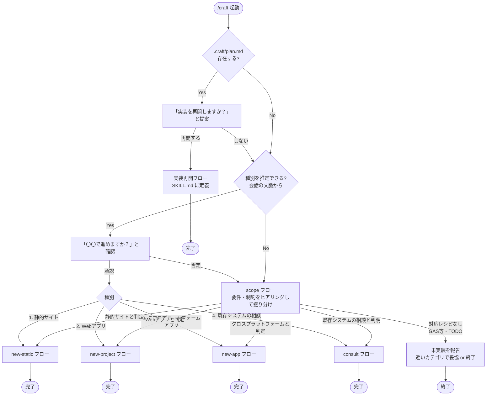
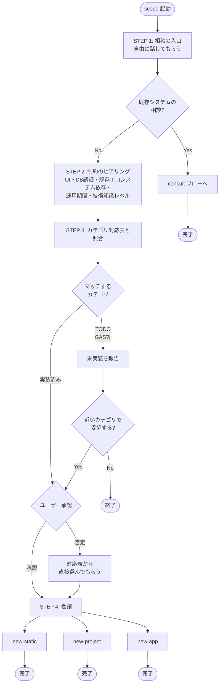
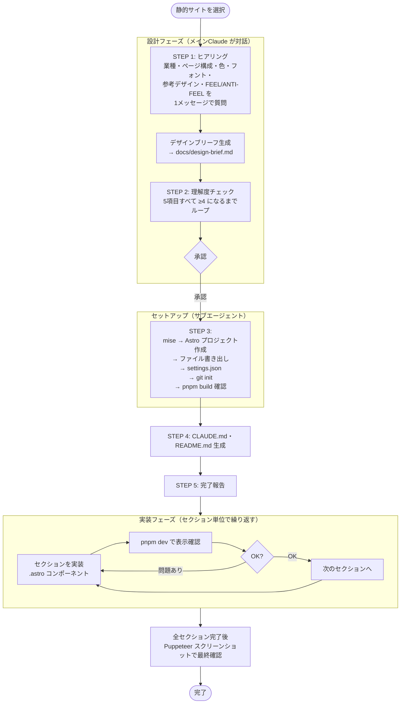
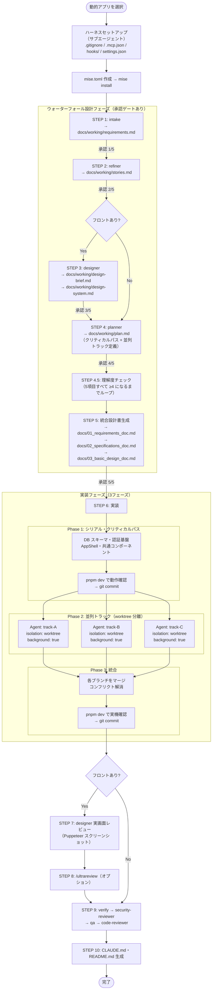
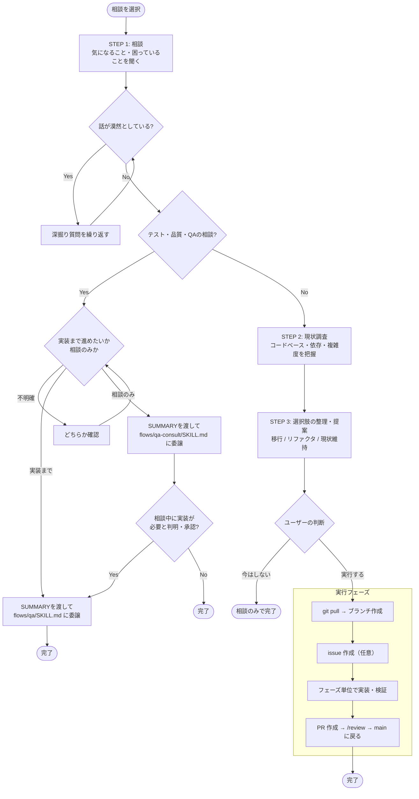
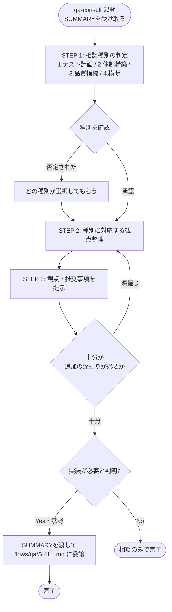
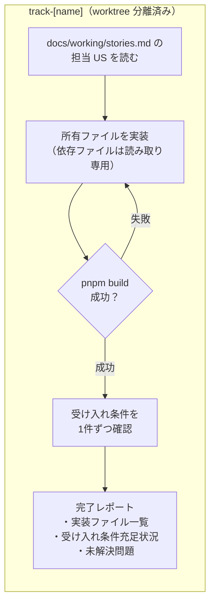
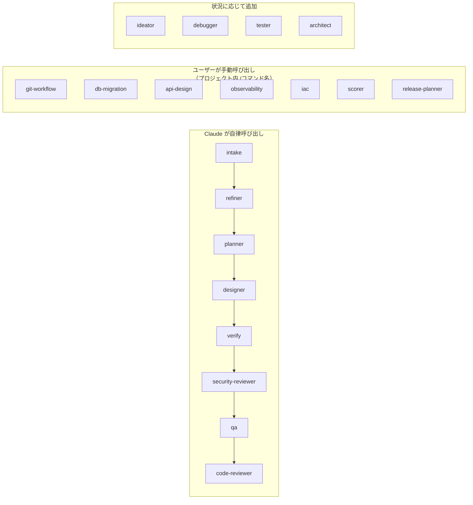

# craft

システム開発に関する部品集。新規プロジェクト立ち上げ・既存システムの相談・各種フローを包含する。
`/craft` スキルで起動し、作業種別を選択して対応するフローに委譲する。

---

## /craft 起動フロー



---

<details>
<summary>技術カテゴリ選定（scope）フロー</summary>



</details>

---

<details>
<summary>静的サイト（new-static）フロー</summary>



</details>

<details>
<summary>動的アプリ（new-project）フロー</summary>



</details>

<details>
<summary>既存システムの相談（consult）フロー</summary>



</details>

<details>
<summary>QA相談（qa-consult）フロー</summary>



</details>

---

<details>
<summary>各フィーチャートラックの処理</summary>

フェーズ2で並列起動される各トラックエージェントの内部フロー。



</details>

<details>
<summary>エージェントの呼び出しタイミング</summary>



</details>

---

## mise の役割

| 管理するもの | 管理しないもの |
|-------------|--------------|
| Node.js / Bun / Flutter のバージョン | React, Drizzle 等のアプリライブラリ |
| pnpm のバージョン | プロジェクト固有の設定ファイル |

- ランタイムとパッケージマネージャーのバージョンを `.mise.toml` で固定する
- アプリのライブラリは `pnpm add`（Node.js系）または `flutter pub add`（Flutter）でインストールする（mise は関与しない）
- `mise install` は新規クローン時・`.mise.toml` 更新時に実行する
- **Flutter の注意:** `flutter = "stable"` は404エラーになる。`mise ls-remote flutter | tail -1` で最新バージョンを確認して固定すること

---

## ディレクトリ構成

```
craft/
├── SKILL.md      # エントリポイント（静的サイト / 動的アプリ / 相談 の選択ルーター）
├── agents/       # サブエージェント定義（Claude が自律的に呼び出す）
├── flows/        # 実行フロー定義（new-project・new-static・consult 等のサブ手順）
├── guidelines/   # 開発ガイドライン（アーキテクチャ・設計手法・DB設計）
├── hooks/        # ツール実行前後に自動で動くスクリプト
├── gitignore     # プロジェクトの .gitignore ひな形
├── mcp.json      # MCP サーバー設定（Puppeteer など）
└── settings.json # Claude Code 設定（権限・フック登録など）
```

### 新規プロジェクトにコピーされるファイル

agents・guidelines は craft から直接参照するためコピーしない。
プロジェクトに展開されるのは以下のみ。

| ファイル | 展開先 |
|---|---|
| `gitignore` | `.gitignore` |
| `mcp.json` | `.mcp.json` |
| `settings.json` | `.claude/settings.json`（絶対パス埋め込み） |
| `hooks/on-session-start.js` | `.claude/hooks/on-session-start.js` |
| `hooks/pre-bash.js` | `.claude/hooks/pre-bash.js` |
| `flows/git-workflow/SKILL.md` | `.claude/commands/git-workflow.md` |

---

## agents/

craft テンプレートに置かれ、Claude が状況に応じて自律呼び出しするサブエージェント。
各ファイルの `description` フィールドが「いつ呼び出すか」の判断基準になる。

### 設計フェーズ（STEP 1〜4 / 自動・順次）

| エージェント | 生成物 | 役割 |
|---|---|---|
| `ideator` | — | アイデア探索・プロジェクト方向性の提案。intake の前段。 |
| `intake` | `docs/working/requirements.md` | 新機能・曖昧な依頼のヒアリングと要件定義。 |
| `refiner` | `docs/working/stories.md` | requirements.md をユーザーストーリーと受け入れ条件に分解。 |
| `designer` | `docs/working/design-brief.md`<br>`docs/working/design-system.md` | UI/UX 設計・デザインブリーフ作成・Puppeteer での実画面レビュー。 |
| `planner` | `docs/working/plan.md` | 実装計画の立案。requirements.md / stories.md を読んでから動く。 |

### 完了チェック（STEP 9 / 自動・順次）

| エージェント | 確認観点 | 役割 |
|---|---|---|
| `verify` | 要件適合 | 要件定義と実装の照合。要件漏れ・スコープ外の混入を検出。 |
| `security-reviewer` | セキュリティ | 認証・認可・OWASP Top 10 の観点でのセキュリティレビュー。 |
| `qa` | ユーザー観点 | テスト戦略・E2E シナリオの網羅性・ユーザー観点での動作検証。 |
| `code-reviewer` | コード品質 | バグ・セキュリティ問題・規約違反の検出。 |

### 状況対応（任意呼び出し）

| エージェント | トリガー | 役割 |
|---|---|---|
| `debugger` | テスト失敗・実行時エラー | エラーの根本原因特定と最小修正案の提示。 |
| `tester` | テストを書きたいとき | 単体・統合テストの実装、テスト環境セットアップ。 |
| `architect` | 設計の大規模見直し | アーキテクチャ評価・テックデット特定・大規模リファクタ方針。 |

### シナリオ別ガイド

| やりたいこと | 修正するエージェント |
|---|---|
| ヒアリング項目・質問の仕方を変えたい | `intake` |
| ユーザーストーリーの粒度・形式を変えたい | `refiner` |
| デザインの評価基準・確認項目を変えたい | `designer` |
| 実装計画の構成・並列トラック分け方針を変えたい | `planner` |
| セキュリティチェックの観点を追加したい | `security-reviewer` |
| テスト戦略・E2E シナリオの方針を変えたい | `qa` |
| コードレビューの観点を追加・変更したい | `code-reviewer` |
| 要件適合チェックの基準を変えたい | `verify` |
| デバッグの手順・深さを変えたい | `debugger` |
| 呼び出しタイミングを変えたい | 該当エージェントの `description` フィールドを編集 |
| モデルを変えたい | 該当エージェントの `model` フィールドを編集（`opus` / `sonnet` / `haiku`） |
| 新しいエージェントを追加したい | `_TEMPLATE.md` をコピーして作る |

<details>
<summary>全エージェント一覧</summary>

| エージェント | 役割 |
|---|---|
| `ideator` | アイデア探索・プロジェクト方向性の提案。intake の前段。 |
| `intake` | 新機能・曖昧な依頼のヒアリング → `docs/working/requirements.md` 生成。 |
| `refiner` | requirements.md をユーザーストーリーと受け入れ条件に分解 → `docs/working/stories.md` 生成。 |
| `designer` | UI/UX 設計・デザインブリーフ作成・Puppeteer での実画面レビュー。 |
| `planner` | 実装計画の立案。requirements.md / stories.md を読んでから動く。 |
| `verify` | 要件定義と実装の照合。要件漏れ・スコープ外の混入を検出。 |
| `security-reviewer` | 認証・認可・OWASP Top 10 の観点でのセキュリティレビュー。 |
| `qa` | テスト戦略・E2E シナリオの網羅性・ユーザー観点での動作検証。 |
| `code-reviewer` | バグ・セキュリティ問題・規約違反の検出。 |
| `debugger` | エラー・テスト失敗の根本原因特定と最小修正案の提示。 |
| `tester` | 単体・統合テストの実装、テスト環境セットアップ。 |
| `architect` | アーキテクチャ評価・テックデット特定・大規模リファクタ方針。 |
| `_TEMPLATE` | 新規エージェント作成用のひな形。 |

</details>

---

## flows/

`/craft` スキルが内部で READ して実行するサブ手順書。
Claude Code のスキルとしては認識されず、メインの SKILL.md からの明示的な READ によって動作する。

| フロー | 役割 |
|---|---|
| `scope` | 種別（kind）が推定できない新規構築の要件・制約をヒアリングし、new-static / new-project / new-app または consult に振り分ける。対応レシピがない技術（GAS等）はTODOとして報告する。 |
| `new-project` | Webアプリ（Node.js系）のセットアップ手順（ハーネス構築〜実装チェーン）。 |
| `new-static` | 静的サイト（LP・PoC）のセットアップ手順。 |
| `new-app` | クロスプラットフォームアプリ（Flutter・React Native・Expo等）のセットアップ手順。Firebase 未取得時のモック実装分岐・`riverpod_generator` + `hive_generator` 競合の注記・Flutter用ビルドコマンド読み替え・実装再開フローを含む。 |
| `consult` | 既存システムへの課題相談。移行・リファクタ・現状維持を含めた選択肢を整理し、実行まで進める。 |
| `git-workflow` | ブランチ作成・コミット・PR 作成など git/gh 操作の安全手順。 |
| `db-migration` | DBスキーマ変更（テーブル追加・カラム変更）の安全な実行手順。 |
| `api-design` | REST API 設計規約（命名・HTTP メソッド・エラーフォーマット）。 |
| `observability` | ログ・トレーシング・ヘルスチェックの設計と実装指針。 |
| `iac` | Terraform/OpenTofu によるインフラ管理の導入・設計・運用手順。 |
| `qa` | 既存プロジェクトのQA基盤構築。テスト方針策定・フレームワーク導入・優先実装・CI組み込みまで一貫して進める。`agents/qa.md`（コードレビュー用エージェント）とは別物。 |
| `qa-consult` | テスト計画・戦略立案、QA体制・プロセス構築、品質指標・バグ管理など、実装を伴わないQA相談。`qa`フローとは別物（相談中に実装が必要と判明したら`qa`に切り替える）。 |
| `scorer` | コードベースの健全性を 6 観点で定期評価。スコアと改善タスクの一覧を返す。 |
| `release-planner` | リリース戦略・デプロイ計画・ロールバック手順の策定。 |
| `_TEMPLATE` | 新規フロー作成用のひな形。 |

---

## guidelines/

開発の指針として参照するガイドライン。直接呼び出すものではない。

| ファイル | 用途 |
|---|---|
| `tdd.md` | TDD（テスト駆動開発）の red-green-refactor サイクルと適用指針。 |
| `ddd.md` | DDD エッセンシャル。CQRS の適用指針を含む。 |
| `layered.md` | レイヤードアーキテクチャの構成。 |
| `modular-monolith.md` | モジュラーモノリスの構成。レイヤードの次のステップ。 |
| `onion.md` | オニオンアーキテクチャの構成。 |
| `db-design.md` | DB スキーマ設計ガイドライン。 |

---

## hooks/

`settings.json` に登録され、ツール実行の前後に自動で動く Node.js スクリプト。

| ファイル | タイミング | 役割 |
|---|---|---|
| `pre-bash.js` | Bash 実行前 | 危険なコマンドのブロック・警告。 |
| `on-session-start.js` | セッション開始時 | git状態表示・mise install 実行。 |

`post-write.js`（フォーマッタ）と `on-stop.js`（型チェック・リント）は技術スタックによって内容が変わるため、テンプレートには含めない。
新規プロジェクト作成時に `planner` エージェントが技術スタックに応じて生成する。
