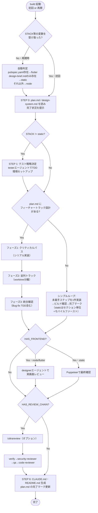
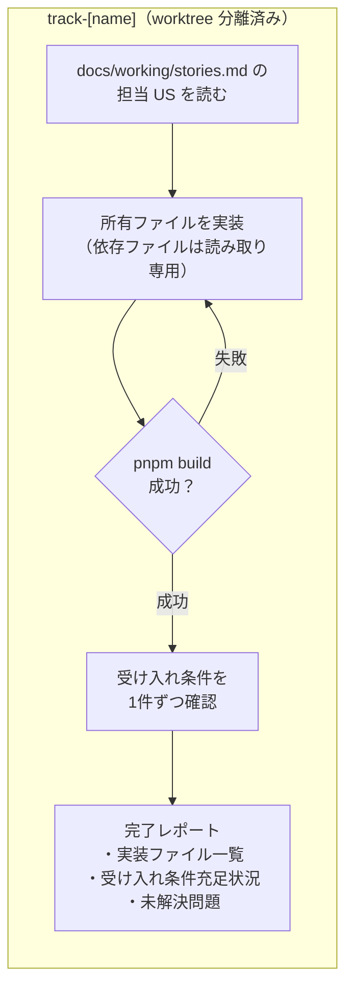

# build（実装フェーズ）フロー

`.craft/plan.md` に基づいて実装を進める共通エンジン。`SKILL.md` に定義。
new-project・new-static・new-app の設計フェーズ完了後、または別セッションでの再開時に、
同じこのフローが呼ばれる（実装ロジックの二重管理をなくすため）。

---

## 各フィーチャートラックの処理

フェーズ2で並列起動される各トラックエージェントの内部フロー。

