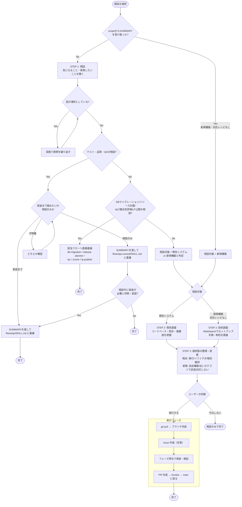

# consult（相談フロー）

既存システムの課題・移行・リファクタ、または新規構築だが既存レシピ（static/project/app）に
当てはまらない技術の相談を受け、選択肢の整理から実行・PRまでを行う
（SIer的に「型にはまらない依頼」を広く受け持つ役割）。

テスト・品質・QAに関する相談の委譲先は [flows/qa-consult/README.md](../qa-consult/README.md) を参照。
db-migration・release-planner・iac・scorer・lp-publish は選択肢整理を経ずに直接委譲する
（各フローが独自のヒアリング・実行手順を持つため）。
