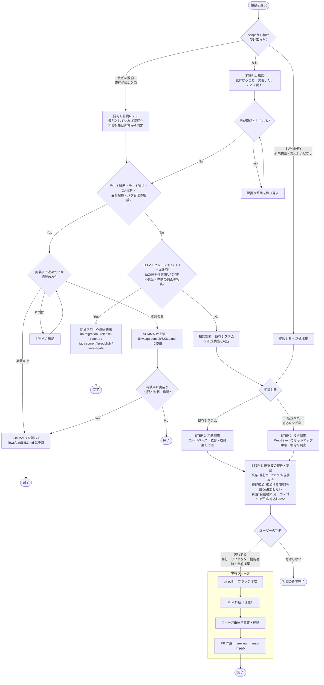

# consult（相談フロー）

既存システムの課題・移行・リファクタ・機能追加、または新規構築だが既存レシピ（static/project/app）に
当てはまらない技術の相談を受け、選択肢の整理から実行・PRまでを行う
（SIer的に「型にはまらない依頼」を広く受け持つ役割）。

```mermaid
flowchart TD
    START([相談を選択]) --> ENTRY{scopeから何か\n受け取った?}
    ENTRY -->|依頼の要約\n既存相談の入口| REQ["要約を前提にする\n漠然としていれば深掘り\n相談対象は内容から判定"]
    ENTRY -->|SUMMARY\n新規構築・対応レシピなし| TARGET2[相談対象 = 新規構築]
    ENTRY -->|なし| C1["STEP 1: 相談\n気になること・実現したいことを聞く"]
    REQ --> QA_CHECK
    C1 --> DEEPEN{話が漠然としている?}
    DEEPEN -->|Yes| C1B["深掘り質問を繰り返す"]
    C1B --> DEEPEN
    DEEPEN -->|No| QA_CHECK{"テスト戦略・テスト追加・QA体制・\n品質指標・バグ管理の相談?"}

    QA_CHECK -->|Yes| QA_MODE{実装まで進めたいか\n相談のみか}
    QA_MODE -->|不明確| ASK_MODE["どちらか確認"]
    ASK_MODE --> QA_MODE
    QA_MODE -->|実装まで| QA["SUMMARYを渡して\nflows/qa/SKILL.md に委譲"]
    QA --> END_Q([完了])
    QA_MODE -->|相談のみ| QAC["SUMMARYを渡して\nflows/qa-consult/SKILL.md に委譲"]
    QAC --> QAC_ESC{相談中に実装が\n必要と判明・承認?}
    QAC_ESC -->|Yes| QA
    QAC_ESC -->|No| END_QC([完了])

    QA_CHECK -->|No| DOMAIN_CHECK{DBマイグレーション/リリース計画/\nIaC/健全性評価/LP公開/\n不具合・挙動の調査の相談?}
    DOMAIN_CHECK -->|Yes| DOMAIN["該当フローへ直接委譲\ndb-migration / release-planner /\niac / scorer / lp-publish /\ninvestigate"]
    DOMAIN --> END_D([完了])

    DOMAIN_CHECK -->|No| TARGET1[相談対象 = 既存システム\nor 新規構築と判定]
    TARGET1 --> TARGET
    TARGET2 --> TARGET
    TARGET{相談対象}
    TARGET -->|既存システム| C2E["STEP 2: 現状調査\nコードベース・依存・複雑度を把握"]
    TARGET -->|新規構築\n対応レシピなし| C2N["STEP 2: 技術調査\nWebSearchでセットアップ手順・制約を調査"]
    C2E --> C3
    C2N --> C3["STEP 3: 選択肢の整理・提案\n既存: 移行/リファクタ/現状維持\n機能追加: 追加する/範囲を絞る/追加しない\n新規: 自前構築/近いカテゴリで妥協/対応しない"]
    C3 --> GATE{ユーザーの判断}
    GATE -->|今はしない| END_N([相談のみで完了])
    GATE -->|実行する\n移行・リファクタ・機能追加・自前構築| C4

    subgraph EXEC["実行フェーズ"]
        C4["git pull → ブランチ作成"]
        C4 --> C5["issue 作成（任意）"]
        C5 --> C6["フェーズ単位で実装・検証"]
        C6 --> C7["PR 作成 → /review → main に戻る"]
    end

    C7 --> END([完了])
```

テスト戦略・テスト追加・QA体制・品質指標・バグ管理に関する相談の委譲先は [flows/qa-consult/README.md](../qa-consult/README.md) を参照。
個別の不具合・挙動の原因調査（「〇〇が動かない」「なぜ△△になるか」）はここに含めず、investigate で扱う。
db-migration・release-planner・iac・scorer・lp-publish・investigate は選択肢整理を経ずに直接委譲する
（各フローが独自のヒアリング・実行手順を持つため）。
investigate は調査後、対応方針が複数ありうる場合に consult のステップ3（選択肢整理）へ接続する。
