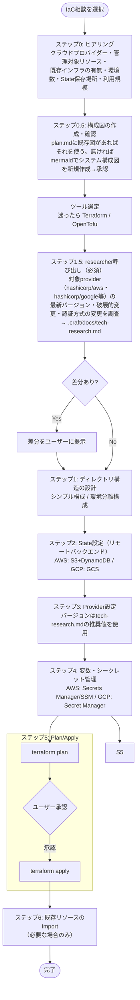

# iac（Infrastructure as Code）フロー

Terraform/OpenTofu によるクラウドインフラのコード管理を導入・設計・運用する。
「設定を間違えると本番インフラが壊れる」領域のため、各ステップでユーザーの確認を挟みながら進める。

## 呼び出し元

- `scope`: アプリ開発を伴わない、インフラのみのコード管理相談から直接委譲
- `consult`: 既存システムへのIaC導入相談から委譲
- `planner`（new-project等）: 本番クラウド公開を伴う新規プロジェクトで「インフラ構成」を決定した後、実装完了後にこのフローでTerraform/OpenTofu化する

## 設計上の注意点

- **破壊的変更（destroy/replace）は必ず赤字で警告し、plan結果の承認を得てからapplyする。**
- クラウドプロバイダーごとの具体例（State/Provider/シークレット管理）はAWS/GCPを用意している。Azure等それ以外は都度researcherで調査する。
- provider・認証方式は変化が速い領域のため、tech-research.md（researcher呼び出し結果）を必ず確認してから設定を確定する。recipeのように固定化した手順を鵜呑みにしない。
