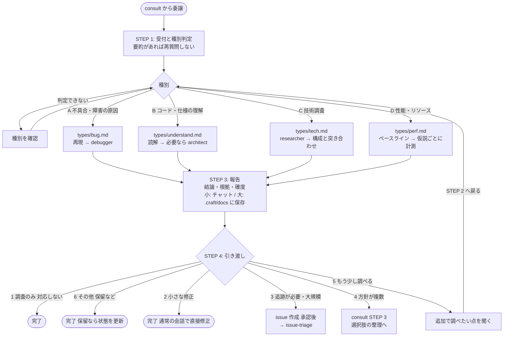

# investigate（調査フロー）

不具合・障害の原因、コード・仕様・影響範囲の理解、技術の実現可能性、性能問題など、
「何が起きているか・どうなっているか」を事実から明らかにする。
修正は行わず、根拠と確度を付けた報告で止まる。`consult` から委譲される。



## 調査の種別

| 種別 | 内容 | 手順ファイル |
|---|---|---|
| A. 不具合・障害の原因 | 症状から原因を特定する | `types/bug.md` |
| B. コード・仕様の理解 | 処理の流れ・影響範囲の把握 | `types/understand.md` |
| C. 技術調査 | 実現可能性・選定材料の調査。自分のコードベースとの突き合わせまで行う | `types/tech.md` |
| D. 性能・リソース | 遅い・重い原因の切り分け | `types/perf.md` |

種別が決まってから、該当する手順ファイルだけを読み込む。

## 共通ルール（`SKILL.md`）

- ソース・設定の編集、コミット、外部サービスへの書き込みはしない。例外はステップ4でユーザーが承認した issue 作成のみ
- 結論には根拠と確度（確定／有力／仮説）を付ける
- debugger / architect / researcher は subagent_type として登録されていないため、各 `.md` の全文を汎用サブエージェントのプロンプトに貼り込んで起動する。互いに依存しないものは同時に起動してよい
- データを変更しうる実行（アプリ起動・テスト・計測）は、実行前にユーザーの許可を得る

## 報告

- 小（単一の種別で、根拠が3点以下）はチャットで報告する
- 大（複数の種別にまたがる、または根拠が4点以上）は `.craft/docs/investigate-<名>.md` に保存し、要点をチャットでも伝える
- 保存した報告には「状態」欄（調査済み／引き渡し済み／対応しない／保留）があり、引き渡しの結果に応じて更新される

## ファイル構成

```
investigate/
├── SKILL.md          # 受付・報告・引き渡し、共通ルール
├── README.md         # 本ファイル
└── types/
    ├── bug.md        # 種別A
    ├── understand.md # 種別B
    ├── tech.md       # 種別C
    └── perf.md       # 種別D
```
