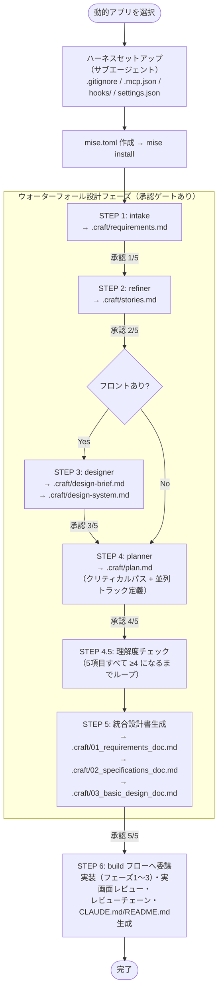

# new-project（動的アプリセットアップ）フロー

Webアプリ（Node.js系。API・DB・認証あり）のハーネス構築〜設計フェーズの手順。
実装フェーズは `build` フローに委譲する。

```mermaid
flowchart TD
    START([動的アプリを選択]) --> SETUP

    SETUP["ハーネスセットアップ\n（サブエージェント）\n.gitignore / .mcp.json / hooks/ / settings.json"]
    SETUP --> MISE["mise.toml 作成 → mise install"]
    MISE --> S1

    subgraph DESIGN["ウォーターフォール設計フェーズ（承認ゲートあり）"]
        S1["STEP 1: intake\n→ .craft/requirements.md"]
        S1 -->|承認 1/5| S2
        S2["STEP 2: refiner\n→ .craft/stories.md"]
        S2 -->|承認 2/5| S3_CHECK

        S3_CHECK{フロントあり?}
        S3_CHECK -->|Yes| S3["STEP 3: designer\n→ .craft/design-brief.md\n→ .craft/design-system.md"]
        S3 -->|承認 3/5| S4
        S3_CHECK -->|No| S4

        S4["STEP 4: planner\n→ .craft/plan.md\n（クリティカルパス + 並列トラック定義）"]
        S4 -->|承認 4/5| S45
        S45["STEP 4.5: 理解度チェック\n（5項目すべて ≥4 になるまでループ）"]
        S45 --> S5
    end

    S5["STEP 5: 統合設計書生成\n→ .craft/01_requirements_doc.md\n→ .craft/02_specifications_doc.md\n→ .craft/03_basic_design_doc.md"]
    S5 -->|承認 5/5| S6

    S6["STEP 6: build フローへ委譲\n実装（フェーズ1〜3）・実画面レビュー・\nレビューチェーン・CLAUDE.md/README.md生成"]
    S6 --> END([完了])
```

実装フェーズの詳細は [flows/build/README.md](../build/README.md) を参照。
