# new-project（動的アプリセットアップ）フロー

Webアプリ（Node.js系。API・DB・認証あり）のハーネス構築〜設計フェーズの手順。
実装フェーズは `build` フローに委譲する。

```mermaid
flowchart TD
    START([動的アプリを選択]) --> S0

    S0["new-project STEP 1: フロントエンドの確認\n（あり/なし → HAS_FRONTEND）"]
    S0 --> SETUP

    SETUP["ハーネスセットアップ\n（サブエージェント）\ngit init / .gitignore / .mcp.json"]
    SETUP --> SETUP2["hooks・settings.json 書き出し\n（メインClaude自身。self-modification誤検知回避のため分離）"]
    SETUP2 --> S1

    subgraph DESIGN["エージェントチェーン（agent-chain.md、承認ゲートあり）"]
        S1["STEP 1: intake\n→ .craft/docs/requirements.md"]
        S1 -->|承認 1/N| S2
        S2["STEP 2: refiner\n→ .craft/docs/stories.md"]
        S2 -->|承認 2/N| S3_CHECK

        S3_CHECK{HAS_FRONTEND?}
        S3_CHECK -->|Yes| S3["STEP 3: designer\n→ .craft/docs/design-brief.md\n→ .craft/docs/design-system.md"]
        S3 --> S3P["プレビュー生成\n→ .craft/previews/design-preview.html（ローカル）"]
        S3P -->|承認 3/N| S4
        S3_CHECK -->|No| S4

        S4["STEP 4: planner\n→ .craft/docs/plan.md\n（開発ランタイム決定 + 基本設計 + クリティカルパス + 並列トラック定義\n+ 本番クラウド公開を伴う場合はインフラ構成決定・researcher呼び出し）"]
        S4 --> S4P["プレビュー生成\n→ .craft/previews/plan-preview.html（ローカル）"]
        S4P -->|承認 4/N| S45
        S45["STEP 5: 理解度チェック\n（5項目すべて ≥4 になるまでループ）"]
        S45 --> S5
    end

    S5["STEP 6: 統合設計書生成\n→ .craft/docs/01_requirements_doc.md\n→ .craft/docs/02_specifications_doc.md\n→ .craft/docs/03_basic_design_doc.md"]
    S5 --> S5P["プレビュー生成\n→ .craft/previews/spec-review.html（ローカル・3文書統合）"]
    S5P -->|承認 5/N| S6

    S6["STEP 7: build フローへ委譲\n開発ランタイム構築・実装（フェーズ1〜3）・実画面レビュー・\nレビューチェーン・CLAUDE.md/README.md生成"]
    S6 --> END([完了])
    END -.->|本番クラウド公開する場合| IAC["iac フローへ\n（plan.mdの「インフラ構成」節をTerraform/OpenTofu化）"]
```

※ N はフロントエンドあり5・なし4（デザインフェーズがスキップされるため）。STEP番号はagent-chain.mdの実際の番号に合わせている。

実装フェーズの詳細は [flows/build/README.md](../build/README.md) を参照。
本番クラウド公開のインフラ構築は [flows/iac/README.md](../iac/README.md) を参照。
