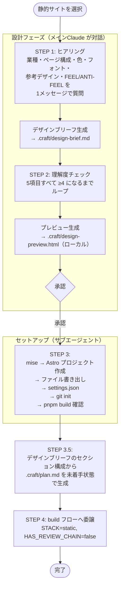

# new-static（静的サイトセットアップ）フロー

Astro + Node.js で静的サイト（LP・PoC・画面モック等）プロジェクトをセットアップする。
ヒアリング・デザインブリーフ・初期 `.craft/plan.md` 生成までを担当し、実装フェーズは `build` フローに委譲する。

実装フェーズの詳細は [flows/build/README.md](../build/README.md) を参照。
