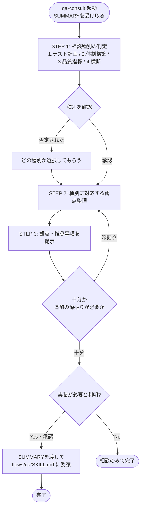

# qa-consult（QA相談フロー）

テスト計画・戦略立案、QA体制・プロセス構築、品質指標・バグ管理など、実装を伴わないQA相談。
`qa`フローとは別物（相談中に実装が必要と判明したら`qa`に切り替える）。

```mermaid
flowchart TD
    START([qa-consult 起動\nSUMMARYを受け取る]) --> S1["STEP 1: 相談種別の判定\n1.テスト計画 / 2.体制構築 / 3.品質指標 / 4.横断"]
    S1 --> CONFIRM{種別を確認}
    CONFIRM -->|否定された| S1B["どの種別か選択してもらう"]
    S1B --> S2
    CONFIRM -->|承認| S2["STEP 2: 種別に対応する観点整理"]
    S2 --> S3["STEP 3: 観点・推奨事項を提示"]
    S3 --> GATE{十分か\n追加の深掘りが必要か}
    GATE -->|深掘り| S2
    GATE -->|十分| ESC_CHECK{実装が必要と判明?}
    ESC_CHECK -->|Yes・承認| QA["SUMMARYを渡して\nflows/qa/SKILL.md に委譲"]
    ESC_CHECK -->|No| END([相談のみで完了])
    QA --> END_Q([完了])
```
