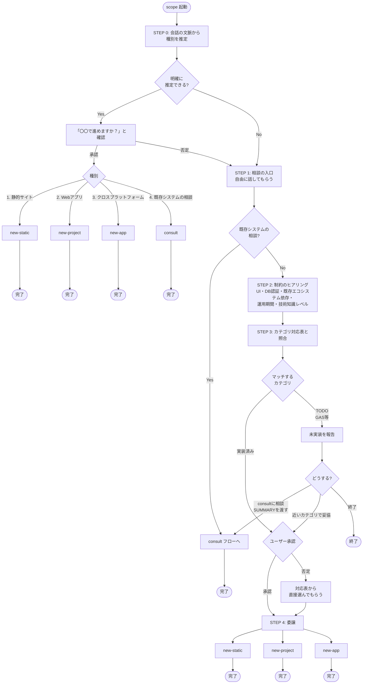

# scope（種別確認・技術カテゴリ選定）フロー

種別（kind）の推定・確認・振り分けを一括で担当する。
会話から明確に推定できる場合は一言確認して new-static / new-project / new-app / consult へ
直接委譲し、不明確な場合（または確認が否定された場合）は要件・制約をヒアリングして振り分ける。
対応レシピがない技術（GAS等）はTODOとして報告し、consultへの相談・近いカテゴリでの妥協・終了を選んでもらう。

