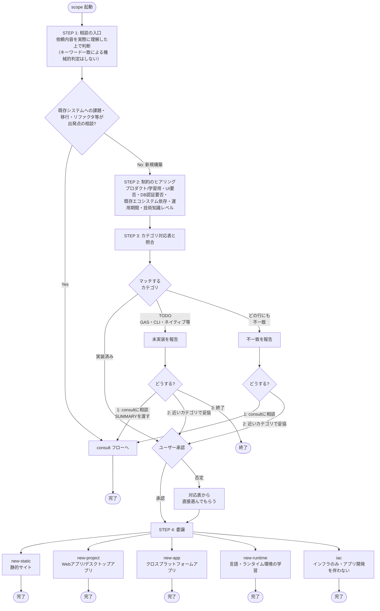

# scope（種別確認・技術カテゴリ選定）フロー

種別（kind）の推定・確認・振り分けを一括で担当する。
表面的なキーワード一致による即断は行わず、必ずステップ2のヒアリングを経てからステップ3で分類する。

```mermaid
flowchart TD
    START([scope 起動]) --> S1

    S1["STEP 1: 相談の入口\n依頼内容を実際に理解した上で判断\n（キーワード一致による機械的判定はしない）"]
    S1 --> EXIST{既存システムへの課題・\n移行・リファクタ等が\n出発点の相談?}
    EXIST -->|Yes| CONSULT[consult フローへ]
    EXIST -->|No: 新規構築| S2

    S2["STEP 2: 制約のヒアリング\nプロダクト/学習用・UI要否・DB認証要否・\n既存エコシステム依存・運用期間・技術知識レベル"]
    S2 --> S3["STEP 3: カテゴリ対応表と照合"]

    S3 --> MATCH{マッチする\nカテゴリ}
    MATCH -->|実装済み| GATE{ユーザー承認}
    MATCH -->|TODO\nGAS・CLI・ネイティブ等| TODOR["未実装を報告"]
    MATCH -->|どの行にも\n不一致| MISFIT["不一致を報告"]

    TODOR --> TODO_CHOICE{どうする?}
    TODO_CHOICE -->|1: consultに相談\nSUMMARYを渡す| CONSULT
    TODO_CHOICE -->|2: 近いカテゴリで妥協| GATE
    TODO_CHOICE -->|3: 終了| END_T([終了])

    MISFIT --> MISFIT_CHOICE{どうする?}
    MISFIT_CHOICE -->|1: consultに相談| CONSULT
    MISFIT_CHOICE -->|2: 近いカテゴリで妥協| GATE

    GATE -->|承認| S4["STEP 4: 委譲"]
    GATE -->|否定| S3B[対応表から\n直接選んでもらう]
    S3B --> S4

    S4 --> STATIC[new-static\n静的サイト]
    S4 --> DYNAMIC[new-project\nWebアプリ/デスクトップアプリ]
    S4 --> APP[new-app\nクロスプラットフォームアプリ]
    S4 --> RUNTIME[new-runtime\n言語・ランタイム環境の学習]
    S4 --> IAC[iac\nインフラのみ・アプリ開発を伴わない]

    CONSULT --> END_C([完了])
    STATIC --> END_S([完了])
    DYNAMIC --> END_D([完了])
    APP --> END_A([完了])
    RUNTIME --> END_R([完了])
    IAC --> END_I([完了])
```

## カテゴリ対応表（STEP3）の判定順序

「学習・検証のためのツール/サンプル/環境構築」と回答された場合、UIの要否に関わらず
「言語・ランタイム環境」（new-runtime）を静的サイト・Webアプリより先に検討する。
「アプリ開発を伴わず、インフラのみをコードで管理したい」場合は iac に直接委譲する
（新規・既存インフラ問わず）。

実際の対応表は `flows/scope/SKILL.md` のステップ3を参照（表の追加・変更が入るため、
このREADMEでは重複させない）。
