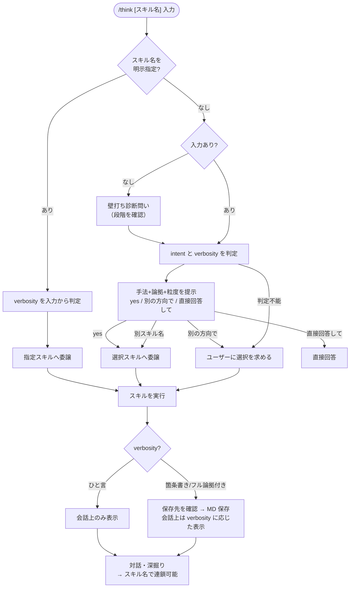

# think

思考・分析・発想の壁打ち相手として機能するオーケストレーター。
**intent**（発散/収束）と **verbosity**（ひと言/箇条書き/フル論拠付き）を判定し、論拠のある手法を持つサブスキルへ委譲する。
サブスキル完了後は `→ <スキル名>` で別スキルへ連鎖できる。

## 使い方

```
# スキルを自動判定（intent も verbosity も自動）
/think "新しい社内ツールのアイデアを出したい"
/think "新製品Xを日本市場に投入する計画（ターゲット：中小企業）"
/think "機能を増やすと操作が複雑になる"

# スキルを明示指定
/think ideate "社員のオンボーディングを改善したい"
/think six-hats "AWSかGCPか、バックエンドのクラウド選定"
/think scamper "自社のサブスクリプション型学習サービス"
/think first-principles "なぜ採用コストはこんなに高いのか"
/think triz "機能を増やすと操作が複雑になる"

# verbosity を指定（キーワードを入力に含める）
/think "チームの生産性を上げるアイデアをひと言で"
/think "新サービスの事業計画を論拠付きで検証したい"

# 壁打ち形式（段階を選んでから始める）
/think

# スキル間の連鎖（実行完了後に入力）
→ six-hats   # アイデアをリスク評価
→ triz       # 矛盾を解消
→ ideate     # 発散に戻る
```

## 利用できるスキル

| intent | スキル | 向いている入力 | 論拠 |
|--------|-------|--------------|------|
| 発散 | [ideate](ideate/) | 課題・問いから具体的な提案・アイデアを生成する | Brown (2008) / Christensen (2016) |
| 発散 | [scamper](scamper/) | 既存のアイデア・製品・プロセスを7軸で変形・発展させたい | Eberle (1971) / Osborn (1953) |
| 収束 | [six-hats](six-hats/) | 具体的な提案・計画・選択肢の多角的検証 | de Bono (1985) |
| 収束 | [first-principles](first-principles/) | 常識・慣習を疑い、ゼロから再構築したい | Aristotle / Musk |
| 収束 | [triz](triz/) | 相反する要件を同時に満たす解法を探したい | Altshuller (1956) |

## 自動ルーティングの基準

**発散**とは、まだ答えがない段階で選択肢やアイデアを広げることを指す。「何ができるか」「どんな可能性があるか」を探るフェーズ。

**収束**とは、すでに何らかの案・問題・計画がある段階で、それを検証・評価・整理・解消することを指す。「この案は妥当か」「問題の本質は何か」を掘り下げるフェーズ。

| intent | 入力の性質 | 委譲先 |
|--------|-----------|-------|
| 発散 | 「アイデアを出してほしい」「案を考えてほしい」など新規発想が目的 | ideate |
| 発散 | 変形・改良する既存の対象が明確に含まれている | scamper |
| 収束 | 具体的な提案・計画・選択肢があり、検証・評価・論点整理が目的 | six-hats |
| 収束 | 「なぜ？」「本当にそうか？」という根本的な疑問がある | first-principles |
| 収束 | 「〇〇するとXXが悪化する」という矛盾・トレードオフがある | triz |
| — | 上記いずれにも当てはまらない | ユーザーに確認 |

## verbosity（出力粒度）

入力に以下のキーワードを含めるか、スキルが聞いてきたときに指定する。

**ひと言**は、移動中・時間がない・まずざっくり把握したいときに向く。**会話上のサマリーのみ返し、ファイル保存は行わない。**

**箇条書き**は、バランスよく要点を確認したいときのデフォルト。箇条書きの案リストを返し、保存先を選べる。

**フル論拠付き**は、提案書・議事録・チームへの共有資料として残したいとき、または深く検討したいときに向く。全セクション＋論文・業界標準の引用を展開する。

| verbosity | キーワード例 | 出力内容 | ファイル保存 |
|-----------|-----------|---------|------------|
| ひと言 | 「ひと言」「さっと」「手短に」 | サマリーのみ | **なし** |
| 箇条書き | （指定なし） | 箇条書き + 要点 | 保存先を聞く |
| フル論拠付き | 「詳しく」「論拠付き」「根拠つき」 | 全セクション + 引用 | 保存先を聞く |

## フロー



## スキルの追加方法

1. `SKILL.md` のサブスキル一覧に、intent（発散/収束）・スキル名・説明を追記する
2. ステップ2の intent 判定に基準を追加する
3. ステップ3の委譲処理に追加する
4. スキルのディレクトリを `think/` 配下に配置し、この README の「利用できるスキル」テーブルに追記する
5. サブスキルの `SKILL.md` に `{verbosity}` に応じた出力セクションを実装する
