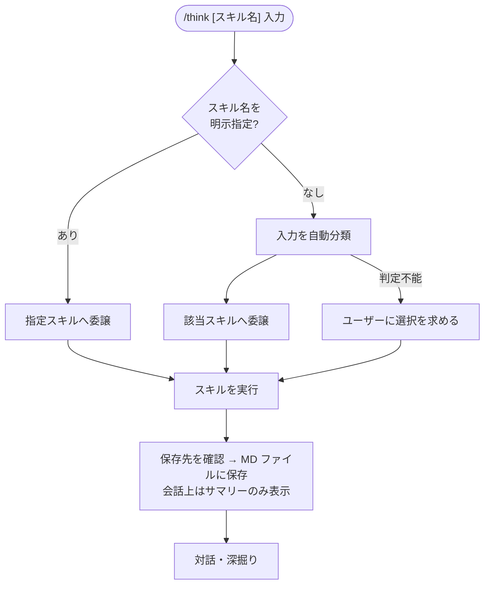

# think

思考・分析・検討の相談を受け付けるオーケストレーター。入力の内容に応じて適切なスキルへ委譲する。

## 使い方

```
# スキルを自動判定
/think "新製品Xを日本市場に投入する計画（ターゲット：中小企業）"

# スキルを明示指定
/think six-hats "AWSかGCPか、バックエンドのクラウド選定"
/think scamper "自社のサブスクリプション型学習サービス"
/think first-principles "なぜ採用コストはこんなに高いのか"
/think triz "機能を増やすと操作が複雑になる"

# 対話形式（スキル選択を対話で行う）
/think
```

## 利用できるスキル

| スキル | 向いている入力 | 論拠 |
|-------|--------------|------|
| [six-hats](six-hats/README.md) | 具体的な提案・計画・選択肢の多角的検証 | de Bono (1985) |
| [scamper](scamper/README.md) | 既存のアイデア・製品・プロセスを変形・発展させたい | Eberle (1971) / Osborn (1953) |
| [first-principles](first-principles/README.md) | 常識・慣習を疑い、ゼロから再構築したい | Aristotle / Musk |
| [triz](triz/README.md) | 相反する要件を同時に満たす解法を探したい | Altshuller (1956) |

## 自動ルーティングの基準

| 入力の性質 | 委譲先 |
|-----------|-------|
| 具体的な提案・計画・選択肢があり、多角的な検証・論点整理が目的 | six-hats |
| 変形・改良の対象となる既存のものがある | scamper |
| 「なぜ？」「本当にそうか？」という根本的な疑問を含む | first-principles |
| 「〇〇するとXXが悪化する」という矛盾・トレードオフを含む | triz |
| 上記いずれにも当てはまらない | ユーザーに確認 |

## フロー



## スキルの追加方法

1. `SKILL.md` の「使えるスキル」テーブルにスキル名と得意な入力を追記する
2. ステップ2に自動分類の判定基準を追加する
3. ステップ3に委譲処理を追加する
4. スキルのディレクトリを `think/` 配下に配置し、このREADMEの「利用できるスキル」テーブルに追記する
