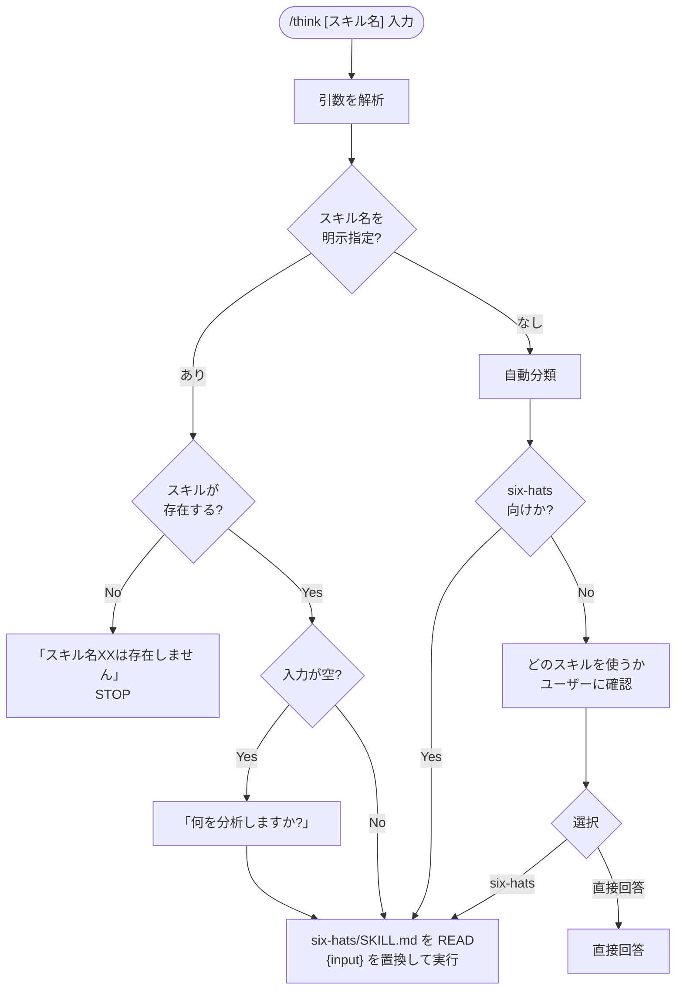

# think

思考・分析・検討の相談を受け付けるオーケストレーター。入力の内容に応じて適切なスキルへ委譲する。

## フロー



## 使い方

```
# スキルを自動判定
/think "新製品Xを日本市場に投入する計画（ターゲット：中小企業）"

# スキルを明示指定
/think six-hats "AWSかGCPか、バックエンドのクラウド選定"

# 対話形式
/think
```

## 委譲ルール

| 入力の性質 | 委譲先 |
|-----------|-------|
| 具体的な提案・計画・選択肢の検証 | six-hats |
| 上記以外 | ユーザーに確認 |

## スキルの追加方法

1. `SKILL.md` の「使えるスキル」テーブルにスキル名と得意な入力を追記する
2. ステップ2に判定基準を追加する
3. ステップ3に委譲処理を追加する
4. スキルのディレクトリを `think/` 配下に配置する
