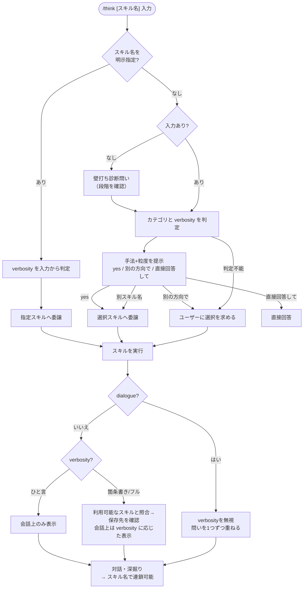

# think

思考・分析・発想の壁打ち相手として機能するオーケストレーター。
相談内容から**カテゴリ**と **verbosity**（ひと言/箇条書き/フル）を判定し、日常使いしやすい手法を持つサブスキルへ委譲する。
サブスキル完了後は `→ <スキル名>` で別スキルへ連鎖できる。

## 使い方

```
# スキルを自動判定（カテゴリも verbosity も自動）
/think "新しい社内ツールのアイデアを出したい"
/think "AWSかGCPか、バックエンドのクラウド選定"
/think "機能を増やすと操作が複雑になる"

# スキルを明示指定
/think dialogue "なんとなく今の仕事に迷いがある"
/think structure "上司に施策を提案する話を筋道立てて整理したい"
/think root-cause "なぜいつも締め切り直前にバタつくのか"
/think decide "転職するか今の会社に残るか"
/think six-hats "新製品Xを日本市場に投入する計画"
/think idea "社員のオンボーディングを改善したい"
/think reflect "今週のスプリントの振り返り"
/think triz "軽量化すると強度が下がる"

# verbosity を指定（キーワードを入力に含める）
/think "チームの生産性を上げるアイデアをひと言で"
/think "新サービスの事業計画を詳しく検証したい"

# 壁打ち形式（段階を選んでから始める）
/think

# スキル間の連鎖（実行完了後に入力）
→ six-hats   # アイデアをリスク評価
→ triz       # 矛盾を解消
→ idea       # 発散に戻る
→ dialogue   # 曖昧な状態に戻って問い直す
```

## 利用できるスキル

| カテゴリ | スキル | 向いている入力 |
|--------|-------|--------------|
| 対話 | [dialogue](dialogue/) | 方向性がまだ無い曖昧な相談に、問いを重ねて壁打ちしたい |
| 構造化・伝達 | [structure](structure/) | 頭の中がごちゃごちゃした考えを整理し、人に伝わる形にしたい |
| 原因を掘る | [root-cause](root-cause/) | 「なぜ」を繰り返し根本原因を探りたい |
| 決める・比較する | [decide](decide/) | 具体的な選択肢のメリット・デメリットを整理したい |
| 多角的に検証する | [six-hats](six-hats/) | 具体的な提案・計画・選択肢の多角的検証 |
| アイデアを出す | [idea](idea/) | 新しい案・改善案を発想したい（既存の対象があればSCAMPERで変形） |
| 振り返る | [reflect](reflect/) | 期間・出来事を振り返り、次に活かしたい |
| 矛盾を解消する | [triz](triz/) | 相反する要件を同時に満たす解法を探したい |

他の切り口を探したい場合は [frameworks-reference.md](frameworks-reference.md)（サブスキル化されていない125個のフレームワーク一覧）を参照する。

## 自動ルーティングの基準

| カテゴリ | 入力の性質 | 委譲先 |
|--------|-----------|-------|
| 対話 | 答え・方向性がまだ定まっていない曖昧な相談 | dialogue |
| 構造化・伝達 | 話・考えを整理し、人に伝わる形にしたい | structure |
| 原因を掘る | 「なぜ？」「本当の原因は？」という根本的な疑問がある | root-cause |
| 決める・比較する | 2つ以上の具体的な選択肢を比較したい | decide |
| 多角的に検証する | 具体的な提案・計画・選択肢があり、検証・評価・論点整理が目的 | six-hats |
| アイデアを出す | 新規発想、または既存対象の変形・発展が目的 | idea |
| 振り返る | 過去の期間・出来事・経験を整理したい | reflect |
| 矛盾を解消する | 「〇〇するとXXが悪化する」という矛盾・トレードオフがある | triz |
| — | 上記いずれにも当てはまらない（答えが一意に定まる事実質問など） | ユーザーに確認 / 直接回答 |

## verbosity（出力粒度）

入力に以下のキーワードを含めるか、スキルが聞いてきたときに指定する。

**ひと言**は、移動中・時間がない・まずざっくり把握したいときに向く。**会話上のサマリーのみ返し、ファイル保存は行わない。**

**箇条書き**は、バランスよく要点を確認したいときのデフォルト。箇条書きの案リストを返し、保存先を選べる。

**フル**は、資料・議事録として残したいとき、または深く検討したいときに向く。全セクションを展開する。

| verbosity | キーワード例 | 出力内容 | ファイル保存 |
|-----------|-----------|---------|------------|
| ひと言 | 「ひと言」「さっと」「手短に」 | サマリーのみ | **なし** |
| 箇条書き | （指定なし） | 箇条書き + 要点 | 保存先を聞く |
| フル | 「詳しく」「丁寧に」「しっかり」 | 全セクション | 保存先を聞く |

**注**: dialogue はこの verbosity 概念を使わない。対話の深さは事前に決めず、ユーザーの反応に応じて自然に調整するため。

## ブリーフィング（補足質問）

各サブスキルは、分析精度に効く度合いに応じてカテゴリごとに個別の質問セットを持つ。verbosityが低いほど質問数も少なく、「ひと言」ではブリーフィングをスキップするスキルが多い。詳細は各サブスキルの `SKILL.md` を参照。

six-hatsのみ、verbosityとは別に「軽量モード（単一プロンプト）」「精密モード（5エージェント並列）」の二段構えを持つ。

## フロー


```mermaid
flowchart TD
    Start(["/think [スキル名] 入力"]) --> Parse{スキル名を\n明示指定?}

    Parse -- あり --> VB1[verbosity を入力から判定]
    VB1 --> Direct[指定スキルへ委譲]

    Parse -- なし --> Check{入力あり?}
    Check -- なし --> Diag["壁打ち診断問い\n（段階を確認）"]
    Diag --> Auto
    Check -- あり --> Auto[カテゴリと verbosity を判定]
    Auto --> Confirm["手法+粒度を提示\nyes / 別の方向で / 直接回答して"]
    Confirm -- yes --> Route[選択スキルへ委譲]
    Confirm -- 別の方向で --> Ask[ユーザーに選択を求める]
    Confirm -- 直接回答して --> Direct2[直接回答]
    Confirm -- 別スキル名 --> Route
    Auto -- 判定不能 --> Ask

    Direct & Route --> Exec[スキルを実行]
    Ask --> Exec

    Exec --> IsDialogue{dialogue?}
    IsDialogue -- はい --> Socratic["verbosityを無視\n問いを1つずつ重ねる"]
    IsDialogue -- いいえ --> Out{verbosity?}
    Out -- ひと言 --> Chat[会話上のみ表示]
    Out -- 箇条書き/フル --> SaveQ[利用可能なスキルと照合→保存先を確認\n会話上は verbosity に応じた表示]
    Chat & SaveQ & Socratic --> Dialog["対話・深掘り\n→ スキル名で連鎖可能"]
```

## スキルの追加方法

1. `SKILL.md` のサブスキル一覧に、カテゴリ・スキル名・説明を追記する
2. ステップ2のカテゴリ判定に基準を追加する
3. ステップ3の委譲処理に追加する
4. スキルのディレクトリを `think/` 配下に配置し、この README の「利用できるスキル」テーブルに追記する
5. サブスキルの `SKILL.md` に `{verbosity}` に応じた出力セクションを実装する
