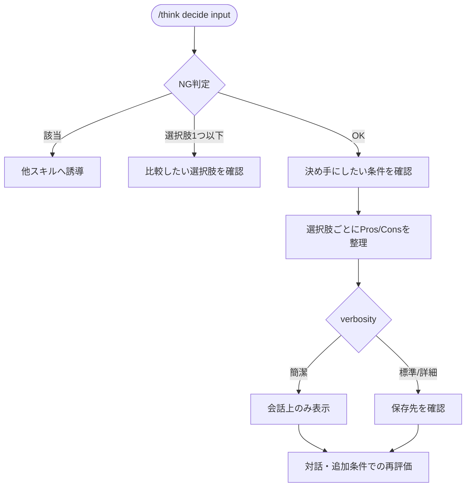

# decide

Pros Consリストで、具体的な選択肢同士を比較するスキル。

## できること・できないこと

| できること | できないこと |
|-----------|------------|
| 2〜3個の具体的な選択肢の比較 | 1つの提案・計画の多角的リスク検証（→ six-hats） |
| 決め手にしたい条件を踏まえた整理 | 新しいアイデアの発想（→ idea） |

判断そのものは代替しない。整理した材料をもとに、最終判断はユーザーに委ねる。

## 使い方

`/think` 経由で呼び出す。verbosity キーワードで出力粒度を調整できる（簡潔/標準/詳細）。

```
/think decide "転職するか今の会社に残るか"
/think decide "AプランかBプランか、コストを重視して"
/think decide    # 選択肢を対話形式で聞く
```

## フロー


