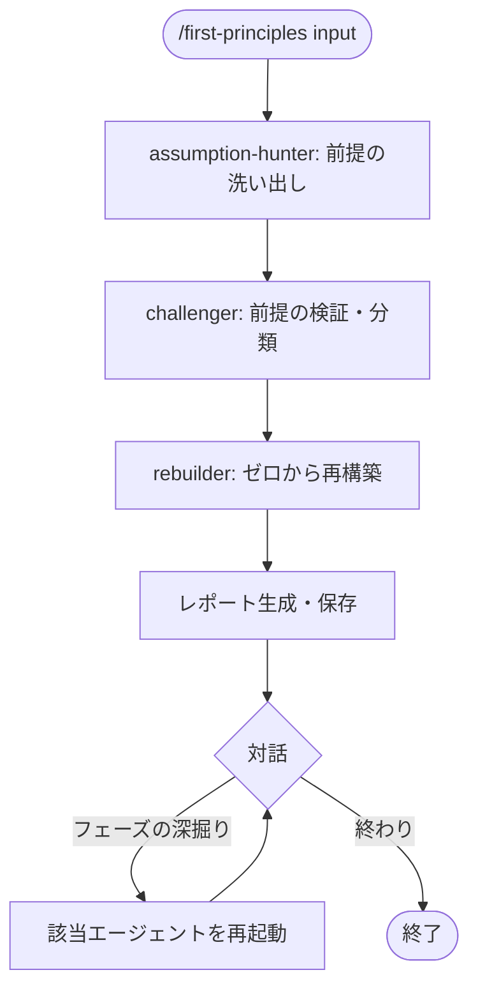

# first-principles

アリストテレスが定式化し（前述, *Physics*）、Elon Musk が現代ビジネスに持ち込んだ
第一原理思考を3エージェントの順次処理で実装したスキル。
「当たり前」を全て疑い、変えられない事実だけから出発してゼロから再構築する。

## できること・できないこと

| できること | できないこと |
|-----------|------------|
| 業界の慣習・常識に埋め込まれた前提を洗い出す | 改良・改善（既存を活かしたい場合 → scamper） |
| 前提を「真の制約」と「慣習」に分類する | 「AとBのどちらが良いか」の比較（→ six-hats） |
| 真の制約のみを与件としてゼロから再構築する | 相反する要件の解消（→ triz） |

## 使い方

`/think` 経由で呼び出す。

```
/think first-principles "なぜ採用コストはこんなに高いのか"
/think first-principles "教育は学校でなければならないという前提を疑いたい"
/think first-principles    # 入力を対話形式で聞く
```

## フロー



## エージェントの役割

| エージェント | 役割 | 出力 |
|------------|------|------|
| assumption-hunter.md | 対象に埋め込まれた前提を5カテゴリで洗い出す | `{assumptions}` |
| challenger.md | 各前提を「真/要検証/慣習」に分類する | `{true_constraints}` / `{challengeable_assumptions}` |
| rebuilder.md | 真の制約のみから出発してアプローチをゼロ設計する | ゼロ設計の理想形・移行起点 |

フェーズは順次依存（前フェーズの出力が次フェーズの入力になる）のため、
six-hats や scamper と異なり並列化していない。

## assumption-hunter の ★ マークについて

慣習由来の前提には★を付けるよう指示している。
★の基準は「物理法則・論理ではなく、慣習に由来するもの」に統一してある。
これは challenger フェーズで「覆せる可能性が高い前提」と判定されるものと一致させるためで、
★がそのまま challenger の重点チェック対象を示す役割を果たす。

## 参考文献

Aristotle. *Physics*, Book I. （第一原理の概念の定式化）
Musk, E. (2013). Reddit AMA. （ビジネスへの応用例として広く参照される）
