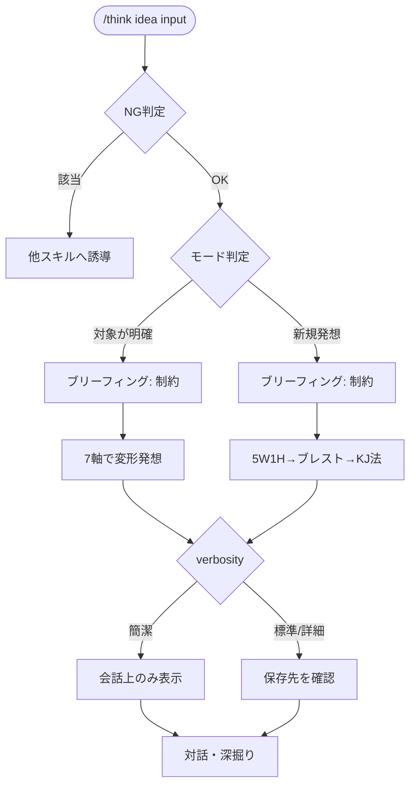

# idea

新しい案・改善案を発想するスキル。既存の対象があるかどうかで、ブレスト（5W1H＋ブレインストーミング＋KJ法）とSCAMPER（7軸の変形発想）を使い分ける。

## できること・できないこと

| できること | できないこと |
|-----------|------------|
| ゼロからの新規アイデア発想 | 既存の提案の検証・評価（→ six-hats） |
| 既存の対象を7軸で変形・発展 | 選択肢の比較（→ decide） |
| 制約を踏まえた発想の絞り込み | 矛盾・トレードオフの解消（→ triz） |

発想段階では良し悪しを評価しない。アイデアを広げることだけが役割。

## 使い方

`/think` 経由で呼び出す。verbosity キーワードで出力粒度を調整できる（簡潔/標準/詳細）。

```
/think idea "社員のオンボーディングを改善したい"
/think idea "既存のサブスクリプション型学習サービスをもっと良くしたい"
/think idea    # 対象を対話形式で聞く
```

## モード

| モード | 向いている場面 | 手法 |
|---|---|---|
| ブレスト | ゼロからの新規発想、対象が漠然としている | 5W1H → ブレインストーミング → KJ法（案が多い場合） |
| SCAMPER | 変形・改良する既存の対象が明確 | S/C/A/M/P/E/R の7軸 |

## フロー


