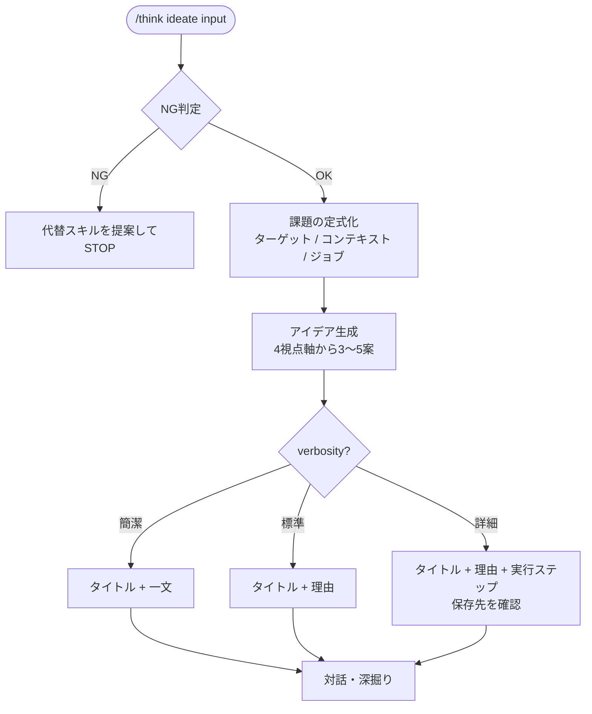

# ideate

Design Thinking（Brown, 2008; Stanford d.school）の発想フェーズと
Jobs-to-be-Done（Christensen et al., 2016）を組み合わせたアイデア生成スキル。

課題・問いを受け取り、「誰の何の困りごとを解決するか」を軸に具体的な提案を返す。
サブエージェントなし・単一ターンで提案が出るため、最も手軽に使えるスキル。

## できること・できないこと

| できること | できないこと |
|-----------|------------|
| 課題・問いから複数の提案を生成する | 既存の提案の検証・評価（→ six-hats） |
| ターゲットや背景が曖昧でも受け付ける | 矛盾・トレードオフの解消（→ triz） |
| 異なる視点軸（ユーザー/技術/ビジネス/逆張り）から多角的に発想する | 常識を疑うゼロベース再構築（→ first-principles） |
| verbosity に応じて箇条書き〜実行ステップ付きで出力する | 変形元が明確な既存サービスの改良（→ scamper） |

## 使い方

`/think` 経由で呼び出す。

```
# 自動判定（ideate に振られる）
/think "新しい社内ツールのアイデアを出したい"
/think "チームの生産性を上げる方法が知りたい"

# 明示指定
/think ideate "社員のオンボーディングを改善したい"
/think ideate "新規顧客獲得の施策を詳しく出して"
/think ideate "BtoB 営業の効率化アイデアを簡潔に"
/think ideate    # 入力を対話形式で聞く
```

## 視点軸

各アイデアは以下のいずれかの軸から出発する（Design Thinking 発想フェーズより）。
なるべく異なる軸から生成し、視点の偏りを防ぐ。

| 軸 | 出発点 |
|----|-------|
| ユーザー視点 | ターゲットの体験・感情・行動から逆算 |
| 技術・手段視点 | 既存の技術・仕組みの組み合わせや転用 |
| ビジネス・運用視点 | コスト・収益・オペレーションの変え方 |
| 逆張り視点 | 常識と逆の方向を試みる |

## verbosity による出力の違い

| verbosity | 出力内容 | ファイル保存 |
|-----------|---------|------------|
| 簡潔 | 案タイトル + 一文説明（3〜5案） | なし |
| 標準 | 案タイトル + 2〜3文の理由つき説明（3〜5案） | なし |
| 詳細 | 案タイトル + 説明 + 実行ステップ（3〜5案） | 保存先を聞く |

## フロー



## 参考文献

Brown, T. (2008). Design Thinking. *Harvard Business Review*, 86(6), 84–92.
Christensen, C. M., Hall, T., Dillon, K., & Duncan, D. S. (2016). *Competing Against Luck: The Story of Innovation and Customer Choice*. HarperBusiness.
