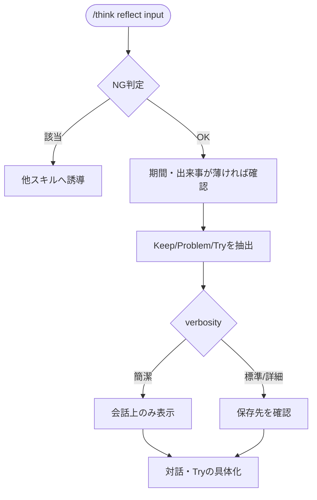

# reflect

KPT（Keep, Problem, Try）で期間・出来事を振り返るスキル。

## できること・できないこと

| できること | できないこと |
|-----------|------------|
| 期間・プロジェクト・出来事の振り返り | 未来の選択肢の比較・意思決定（→ decide） |
| Keep/Problem/Tryの3観点での整理 | 新しいアイデアの発想（→ idea） |

判断・評価は代わりに下さない。本人の経験に基づく振り返りを整理する役に徹する。

## 使い方

`/think` 経由で呼び出す。verbosity キーワードで出力粒度を調整できる（簡潔/標準/詳細）。

```
/think reflect "今週のスプリントの振り返り"
/think reflect "先月の営業活動、目標未達だった"
/think reflect    # 期間や出来事を対話形式で聞く
```

## フロー


