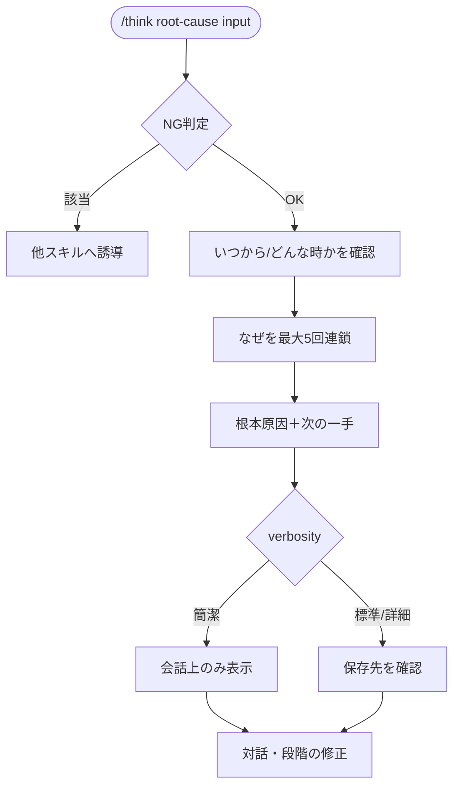

# root-cause

5つのWhyで「なぜ？」を繰り返し、繰り返し起きる問題の根本原因を掘るスキル。

## できること・できないこと

| できること | できないこと |
|-----------|------------|
| 問題が繰り返し起きる根本原因の深掘り | 既存の改良・改善（→ idea） |
| 表面的な対処と本質的な原因の切り分け | 選択肢の比較・意思決定（→ decide／six-hats） |

「なぜ」の連鎖を断定しない。事実と推論（推定）・要確認を区別して提示する。

## 使い方

`/think` 経由で呼び出す。verbosity キーワードで出力粒度を調整できる（簡潔/標準/詳細）。

```
/think root-cause "なぜいつも締め切り直前にバタつくのか"
/think root-cause "会議が長引くのはなぜか、詳しく"
/think root-cause    # 問題を対話形式で聞く
```

## フロー


