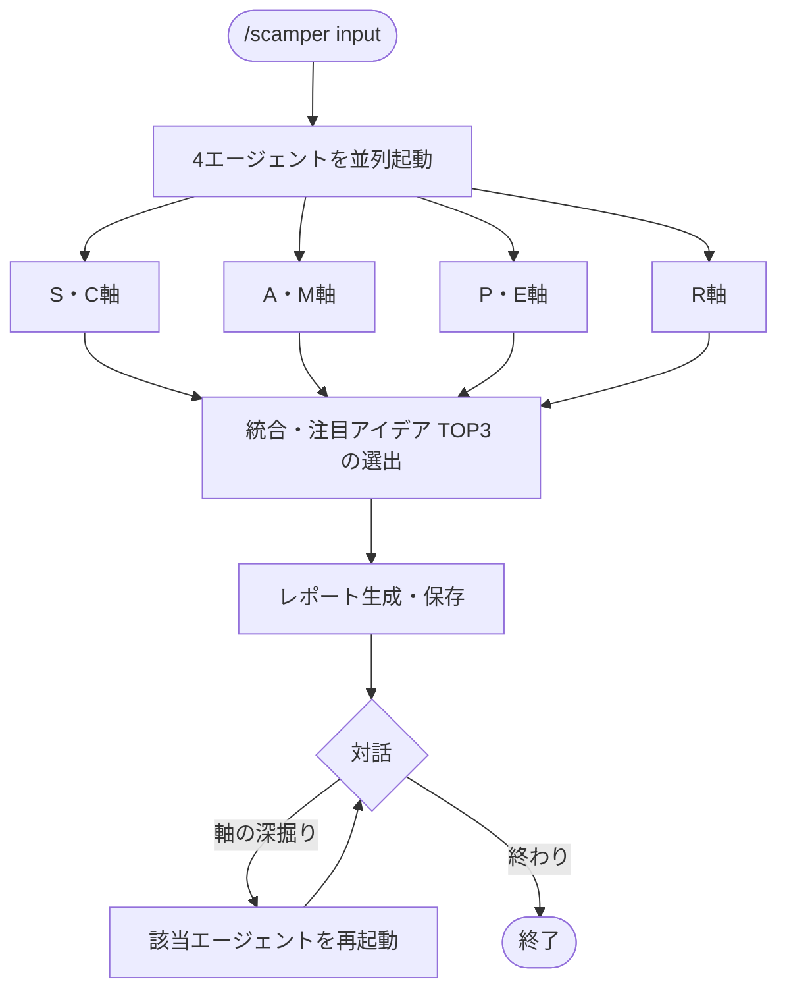

# scamper

Alex Osborn「Applied Imagination」(1953) の発想法を Bob Eberle (1971) が体系化した
SCAMPER 法を4エージェントで実装したスキル。
既存のアイデア・製品・サービス・プロセスを7軸で変形し、新たなアイデアを引き出す。

## できること・できないこと

| できること | できないこと |
|-----------|------------|
| 既存の対象を7軸で変形・発展させる | 変形する対象がない完全ゼロの発想 |
| 競合との差別化アイデアを発掘する | アイデアの良し悪しの評価・検証 |
| 行き詰まった改善案に新視点を与える | 相反する要件の解消（→ triz） |

## 使い方

`/think` 経由で呼び出す。verbosity キーワードで出力粒度を調整できる（簡潔/標準/詳細）。

```
/think scamper "自社のサブスクリプション型学習サービス"
/think scamper "現在の採用面接プロセス"
/think scamper "競合のフリーミアムモデルを詳しく変形したい"
/think scamper    # 入力を対話形式で聞く
```

## 7軸とエージェントの対応

| 軸 | 意味 | 担当エージェント |
|----|------|----------------|
| S | Substitute（代替）: 要素を別のものに置き換える | substitute-combine.md |
| C | Combine（結合）: 別のものと組み合わせる | substitute-combine.md |
| A | Adapt（適応）: 他分野から借用・転用する | adapt-modify.md |
| M | Modify/Magnify（変更・拡大縮小）: スケールや属性を変える | adapt-modify.md |
| P | Put to other uses（転用）: 全く別の用途・市場に使う | other-uses-eliminate.md |
| E | Eliminate（削除）: 要素を取り除いてシンプルにする | other-uses-eliminate.md |
| R | Reverse/Rearrange（逆転・再配置）: 逆にする・順序を変える | reverse.md |

S+C、A+M、P+E はそれぞれ意味的に隣接しているため1エージェントに統合している。
R のみが独立しているのは、逆転と再配置が他軸と発想パターンが大きく異なるため。

## フロー



## 参考文献

Osborn, A. F. (1953). *Applied Imagination*. Scribner.
Eberle, B. (1971). *SCAMPER: Games for Imagination Development*. DOK Publishers.
