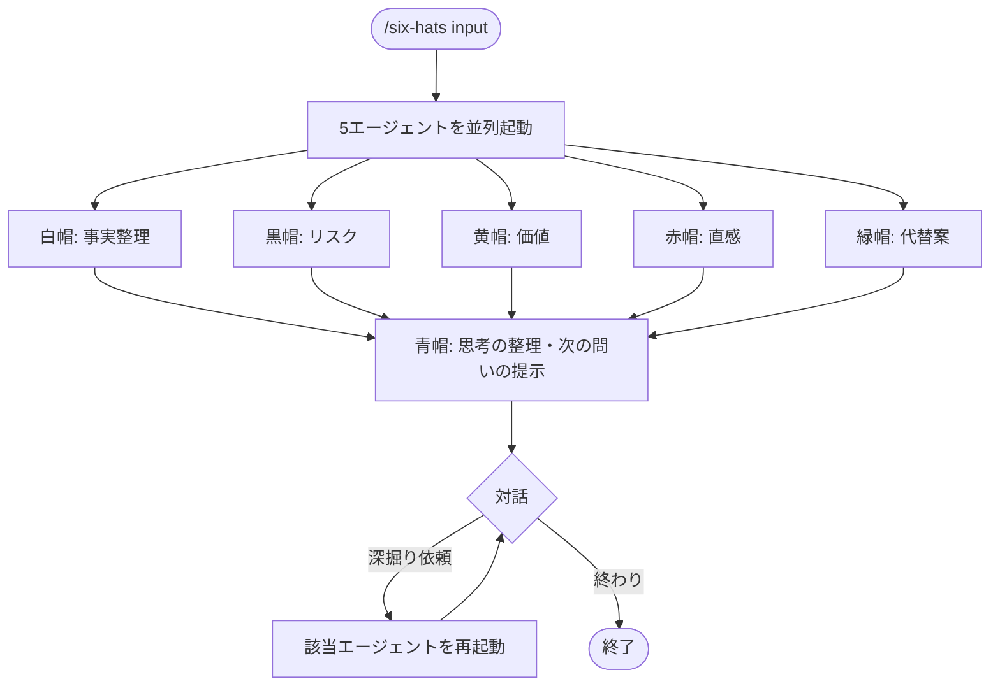

# six-hats

Edward de Bono の Six Thinking Hats (1985) を6エージェントで実装したスキル。
具体的な提案・計画・選択肢を渡すと、6視点の並列分析レポートを生成する。

## できること・できないこと

| できること | できないこと |
|-----------|------------|
| 提案・計画の多角的検証 | 答えや提案を1つ生成すること |
| 2択以上の選択肢の比較 | 「何かいいものはないか」のような広い問いへの回答 |
| 意思決定前の論点整理 | 事実調査・情報検索 |

Six Hats は人間の判断を支援するツールであり、判断そのものを代替しない（de Bono, 1985）。

## 使い方

`/think` 経由で呼び出す。

```
/think six-hats "新製品Xを日本市場に投入する計画（ターゲット：中小企業）"
/think six-hats "AWSかGCPか、バックエンドのクラウド選定"
/think six-hats    # 入力を対話形式で聞く
```

## 帽子の役割

| 帽子 | 役割（論文準拠） | 担当 |
|------|------|------|
| 白 | 事実・データ・不明点の整理 | white.md |
| 黒 | リスク・問題点・失敗シナリオ | black.md |
| 黄 | 価値・メリット・ベストシナリオ | yellow.md |
| 赤 | 感情・直感・第一印象 | red.md |
| 緑 | 代替案・改善アイデア・創造的提案 | green.md |
| 青 | プロセス管理・思考の整理・次の問いの提示（SKILL.md本体） | — |

## フロー



## 参考文献

de Bono, E. (1985). *Six Thinking Hats*. Little, Brown and Company.
