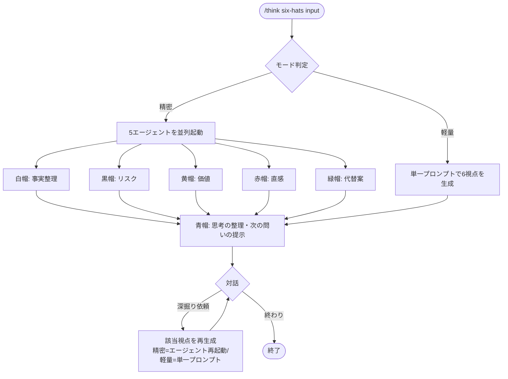

# six-hats

Six Thinking Hats（6つの帽子）の視点で、具体的な提案・計画・選択肢を多角的に検証するスキル。
日常の軽い検証は単一プロンプトの軽量モード、しっかり検証したい時は5エージェント並列の精密モードで分析する。

## できること・できないこと

| できること | できないこと |
|-----------|------------|
| 提案・計画の多角的検証 | 答えや提案を1つ生成すること |
| 2択以上の選択肢の比較 | 「何かいいものはないか」のような広い問いへの回答 |
| 意思決定前の論点整理 | 事実調査・情報検索 |

Six Hats は人間の判断を支援するツールであり、判断そのものを代替しない。

## 使い方

`/think` 経由で呼び出す。verbosity キーワードで出力粒度を調整できる（簡潔/標準/詳細）。verbosity=簡潔/標準は軽量モード、詳細は精密モードで動く（「精密に」「さっと」等で明示指定も可）。

```
/think six-hats "新製品Xを日本市場に投入する計画（ターゲット：中小企業）"
/think six-hats "AWSかGCPか、バックエンドのクラウド選定"
/think six-hats "スタートアップ参画を詳しく検証したい"
/think six-hats    # 入力を対話形式で聞く
```

## モード

| モード | 発動条件 | 実装 |
|---|---|---|
| 軽量 | verbosity=簡潔/標準、または「さっと」等の明示指定 | 単一プロンプトで6視点をまとめて生成 |
| 精密 | verbosity=詳細、または「精密に」等の明示指定 | 5エージェント並列＋青帽統合 |

## 帽子の役割

| 帽子 | 役割 | 精密モードの担当 |
|------|------|------|
| 白 | 事実・データ・不明点の整理 | white.md |
| 黒 | リスク・問題点・失敗シナリオ | black.md |
| 黄 | 価値・メリット・ベストシナリオ | yellow.md |
| 赤 | 感情・直感・第一印象 | red.md |
| 緑 | 代替案・改善アイデア・創造的提案 | green.md |
| 青 | プロセス管理・思考の整理・次の問いの提示（SKILL.md本体） | — |

## フロー


```mermaid
flowchart TD
    Start([/think six-hats input]) --> ModeCheck{モード判定}
    ModeCheck -- 軽量 --> Single[単一プロンプトで6視点を生成]
    ModeCheck -- 精密 --> P[5エージェントを並列起動]
    P --> W[白帽: 事実整理]
    P --> B[黒帽: リスク]
    P --> Y[黄帽: 価値]
    P --> R[赤帽: 直感]
    P --> G[緑帽: 代替案]
    W & B & Y & R & G --> Blue[青帽: 思考の整理・次の問いの提示]
    Single --> Blue
    Blue --> Dialog{対話}
    Dialog -- 深掘り依頼 --> Rerun[該当視点を再生成\n精密=エージェント再起動/軽量=単一プロンプト]
    Rerun --> Dialog
    Dialog -- 終わり --> End([終了])
```
