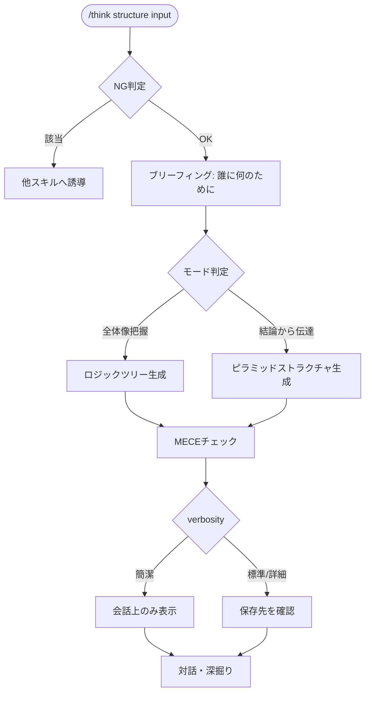

# structure

ロジックツリー（要素分解・全体像把握）とピラミッドストラクチャ（結論から伝える）で、頭の中の話を整理するスキル。

## できること・できないこと

| できること | できないこと |
|-----------|------------|
| 頭の中がごちゃごちゃした考えの整理 | 新しいアイデアの発想（→ idea） |
| 結論から伝わる形への組み立て | 選択肢の比較・意思決定（→ decide） |
| モレなく・ダブりなく全体像を把握する | 根本原因の深掘り（→ root-cause） |

判断・結論そのものは代替しない。整理された構造を提示し、最終判断はユーザーに委ねる。

## 使い方

`/think` 経由で呼び出す。verbosity キーワードで出力粒度を調整できる（簡潔/標準/詳細）。

```
/think structure "新規事業の検討事項が多すぎて頭の中がぐちゃぐちゃ"
/think structure "上司に施策を提案する話を筋道立てて整理したい"
/think structure    # 入力を対話形式で聞く
```

## モード

| モード | 向いている場面 | 構造 |
|---|---|---|
| ロジックツリー | 要素を洗い出し、全体像をモレなく把握したい | 主題→要素→詳細の階層分解 |
| ピラミッドストラクチャ | 結論から筋道立てて人に伝えたい | 結論→根拠グループ→詳細の3階層 |

生成後、MECE（モレなくダブりなく）の観点で重複・抜けを一言チェックする。

## フロー


