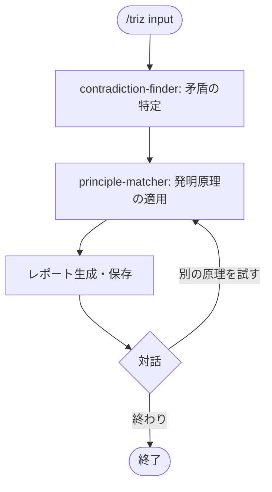

# triz

Genrich Altshuller が40万件のソ連特許を分析して開発した体系的発明方法論 TRIZ（1956〜）を
2エージェントで実装したスキル。矛盾を特定し、発明原理から解決の方向性を引き出す。

## できること・できないこと

| できること | できないこと |
|-----------|------------|
| 相反する要件の矛盾を構造化して特定する | 妥協点・トレードオフを探すこと |
| 発明原理を使って矛盾を解消する方向性を示す | 設計・実装の詳細を決定すること |
| 技術的矛盾・物理的矛盾の両方に対応する | 矛盾が明確でない漠然とした問いへの回答 |

TRIZ は「妥協によるバランス」ではなく「矛盾そのものの解消」を目指す（Altshuller, 1996）。

## 使い方

`/think` 経由で呼び出す。

```
/think triz "機能を増やすと操作が複雑になる"
/think triz "軽量化すると強度が下がる"
/think triz    # 入力を対話形式で聞く
```

## フロー



## エージェントの役割

| エージェント | 役割 |
|------------|------|
| contradiction-finder.md | 技術的矛盾・物理的矛盾を特定し、最重要矛盾を1つ選ぶ |
| principle-matcher.md | 矛盾に対して発明原理を3〜5個選び、解決の方向性を示す |

## 発明原理の選定について

TRIZ の原論文（Altshuller, 1996）では40の発明原理が定義されているが、
このスキルでは**22原理に絞って実装**している。

### 除外した18原理と理由

以下の原理は物理・材料・化学の工学的文脈に特化しており、
ビジネス・サービス・情報設計などの一般的なアイデア発想では
適切な適用先が見出しにくいため除外した。

| 番号 | 原理名 | 除外理由 |
|------|--------|---------|
| 8 | Anti-weight（重力補償）| 物理的な重力・浮力の操作に限定 |
| 11 | Beforehand cushioning（事前緩衝）| 物理的な衝撃・応力の緩和に限定 |
| 12 | Equipotentiality（等ポテンシャル）| 重力ポテンシャル・電位差の均一化に限定 |
| 14 | Spheroidality（球面化）| 直線→曲線・球面への形状変換に限定 |
| 18 | Mechanical vibration（機械振動）| 振動・超音波の利用に限定 |
| 20 | Continuity of useful action（有用作用の継続）| 機械的な連続稼働最適化に限定 |
| 21 | Skipping（高速通過）| 有害なプロセスを物理的に高速通過することに限定 |
| 27 | Cheap short-living（消耗品化）| 物理的な部品・製品の使い捨てに限定 |
| 29 | Pneumatics and hydraulics（気体・液体）| 空気圧・液圧システムに限定 |
| 30 | Flexible shells and thin films（柔軟な薄膜）| 材料の形状・薄膜化に限定 |
| 31 | Porous materials（多孔質材料）| 材料の多孔質化に限定 |
| 32 | Color changes（色の変化）| 光・色・透明度の変化に限定 |
| 33 | Homogeneity（均質化）| 接触物質の材料統一に限定 |
| 36 | Phase transitions（相転移）| 固体・液体・気体の状態変化に限定 |
| 37 | Thermal expansion（熱膨張）| 熱による膨張・収縮に限定 |
| 38 | Strong oxidants（強酸化剤）| 酸化・燃焼・化学反応に限定 |
| 39 | Inert atmosphere（不活性環境）| 化学的な不活性雰囲気の利用に限定 |
| 40 | Composite materials（複合材料）| 材料の組み合わせによる特性向上に限定 |

### 採用した22原理

汎用的に適用できると判断した以下の22原理を採用している。

| 番号 | 原理名 | 汎用的な適用先の例 |
|------|--------|-----------------|
| 1 | Segmentation（分割）| サービスのモジュール化、役割分担 |
| 2 | Taking out（抽出）| コア機能の特定、エッセンスの分離 |
| 3 | Local quality（局所最適）| ユーザーセグメント別の最適化 |
| 4 | Asymmetry（非対称）| 権限・リソースの非対称配分 |
| 5 | Merging（統合）| 業務・機能・チームの統合 |
| 6 | Universality（多機能化）| 一つのものに複数の役割を持たせる |
| 7 | Nesting（入れ子）| 階層構造・包含関係の活用 |
| 9 | Preliminary anti-action（事前の反作用）| リスクの先行対処 |
| 10 | Preliminary action（事前の作用）| 事前準備・先行投資 |
| 13 | The other way round（逆転）| ビジネスモデルの逆転、役割の交換 |
| 15 | Dynamics（動態化）| 固定料金→従量制、固定機能→カスタマイズ |
| 16 | Partial or excessive actions（過不足）| MVP開発、過剰スペックで問題を回避 |
| 17 | Another dimension（次元変換）| 視点・時間軸・空間の変換 |
| 19 | Periodic action（周期的作用）| バッチ処理化、定期レビュー導入 |
| 22 | Blessing in disguise（転禍為福）| 制約・欠点を強みに転換 |
| 23 | Feedback（フィードバック）| KPI設定、ループの導入 |
| 24 | Intermediary（仲介）| プラットフォーム化、仲介者の活用 |
| 25 | Self-service（セルフサービス）| ユーザー自身が解決する仕組み |
| 26 | Copying（複写）| プロトタイプ・シミュレーションの活用 |
| 28 | Mechanics substitution（置換）| 手動→自動化、アナログ→デジタル |
| 34 | Discarding and recovering（分解と再生）| 使い捨て→リサイクル、廃棄→転用 |
| 35 | Parameter changes（パラメータ変更）| 価格・速度・品質などの特性変更 |

工学的な問題（材料設計・製造プロセスなど）に使う場合は、
除外した18原理を `principle-matcher.md` に追記して再適用することを推奨する。

## 参考文献

Altshuller, G. (1996). *And Suddenly the Inventor Appeared: TRIZ, the Creative Problem Solving*. Technical Innovation Center.
