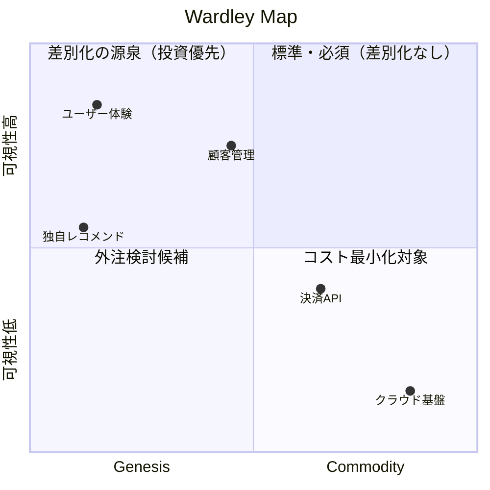

# wardley

事業・製品・システムのコンポーネントをバリューチェーン × 進化軸でマッピングし、
内製・外注・差別化の戦略的判断を導く。Simon Wardley (2005〜) の手法。

## 使い方

```
/think wardley "SaaSスタートアップの開発体制"
/think wardley "ECサイトの決済・在庫・物流の構成"
/think wardley "IoTプラットフォーム事業"
```

## 出力例



## エージェント構成

chain-mapper → evolution-assessor → strategy-synthesizer の3段階逐次処理。
