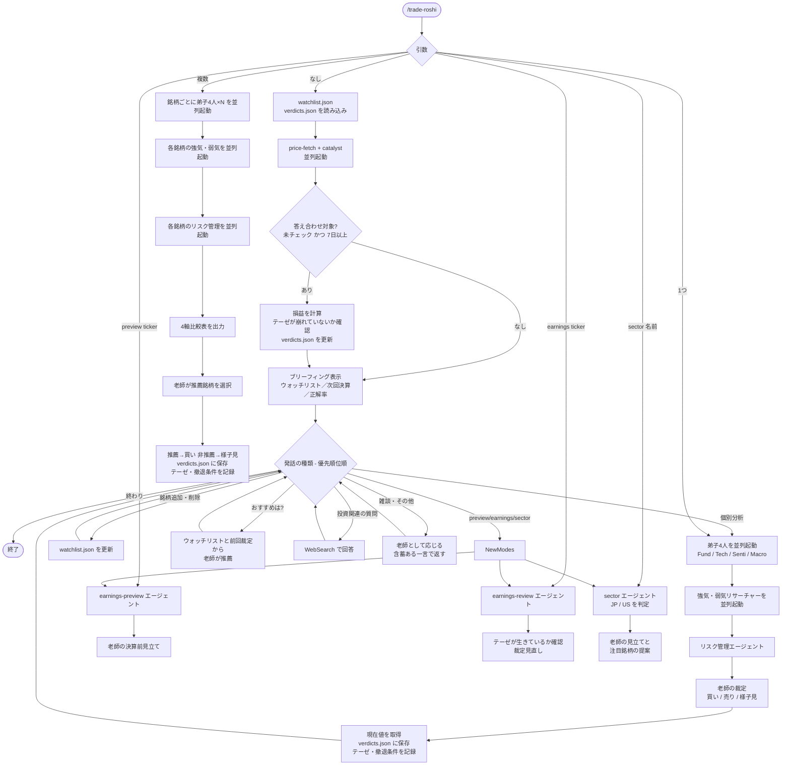

# trade-roshi

投資道場スキル。老師と弟子たちが株式銘柄を分析し、裁定を下す。

## セットアップ

専用フォルダを1つ作り、そこを「道場」として使い続けるのが基本的な使い方。

```bash
mkdir ~/trade-roshi && cd ~/trade-roshi
```

以降はこのフォルダで Claude Code を起動するたびに、ウォッチリストや裁定履歴が引き継がれる。

## 使い方

```
/trade-roshi                   # ブリーフィング（ウォッチリスト確認・答え合わせ・雑談）
/trade-roshi AAPL              # 単一銘柄分析
/trade-roshi AAPL MSFT         # 複数銘柄比較・推薦
/trade-roshi preview AAPL      # 決算前シナリオ分析
/trade-roshi earnings AAPL     # 決算後レビュー・テーゼ確認
/trade-roshi sector 半導体      # セクター概観・注目銘柄
```

## フロー



## データ

スキルを呼び出したディレクトリの `.trade-roshi/` 以下に保存される。

```
.trade-roshi/
  watchlist.json   # ウォッチリスト銘柄
  verdicts.json    # 裁定履歴（答え合わせ済みから90日で自動削除）
```

verdicts.json の各エントリ:

```json
{
  "ticker": "AAPL",
  "date": "2026-05-29",
  "price": 185.50,
  "verdict": "買い",
  "thesis": "AI向けハード需要でサイクル転換期",
  "exit_condition": "iPhone出荷が3四半期連続減少",
  "checked": false,
  "result_pct": null,
  "checked_date": null
}
```

## エージェント構成

```
agents/
  price-fetch.md       # 現在株価の一括取得
  catalyst.md          # 次回決算日・権利確定日の取得（ブリーフィングで並列起動）
  fundamental.md       # ファンダメンタル分析
  technical.md         # テクニカル分析
  sentiment.md         # センチメント分析
  macro.md             # マクロ・セクター分析
  bull-researcher.md   # 強気根拠の組み立て
  bear-researcher.md   # 弱気根拠の組み立て
  risk-mgmt.md         # リスク評価
  earnings-preview.md  # 決算前シナリオ分析
  earnings-review.md   # 決算後実績確認・テーゼ評価
  sector.md            # セクター概観・注目銘柄抽出
```

## 免責事項

このスキルはジョークコンテンツです。老師の裁定は投資判断の根拠にしないこと。老師は損失に責任を負わない。
