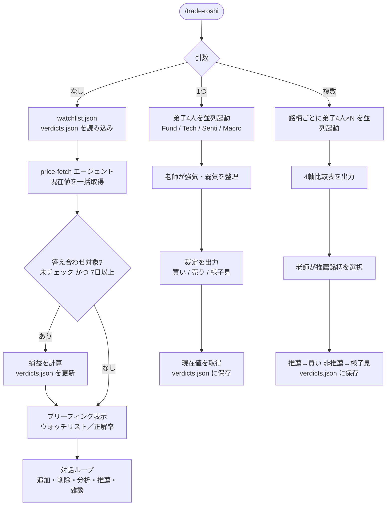

# trade-roshi

投資道場スキル。老師と弟子たちが株式銘柄を分析し、裁定を下す。

## 使い方

```
/trade-roshi              # ブリーフィング（ウォッチリスト確認・答え合わせ・雑談）
/trade-roshi AAPL         # 単一銘柄分析
/trade-roshi AAPL MSFT    # 複数銘柄比較・推薦
```

## フロー



## データ

スキルを呼び出したディレクトリの `.trade-roshi/` 以下に保存される。

```
.trade-roshi/
  watchlist.json   # ウォッチリスト銘柄
  verdicts.json    # 裁定履歴（答え合わせ済みから90日で自動削除）
```

## 免責事項

このスキルはジョークコンテンツです。老師の裁定は投資判断の根拠にしないこと。老師は損失に責任を負わない。
